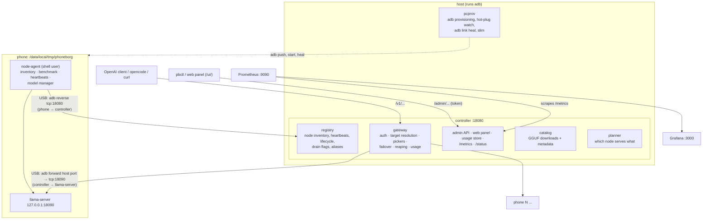
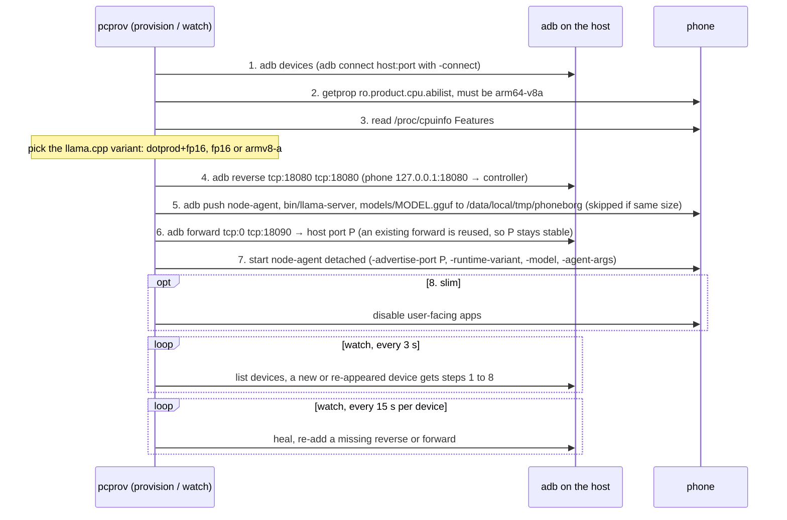
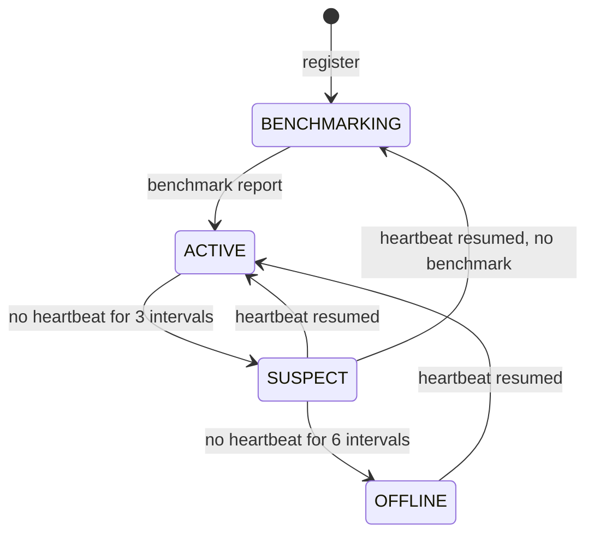
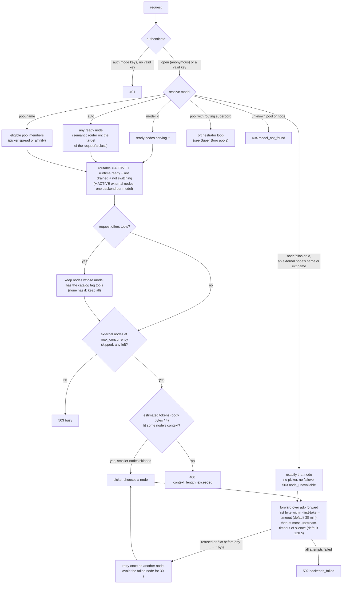
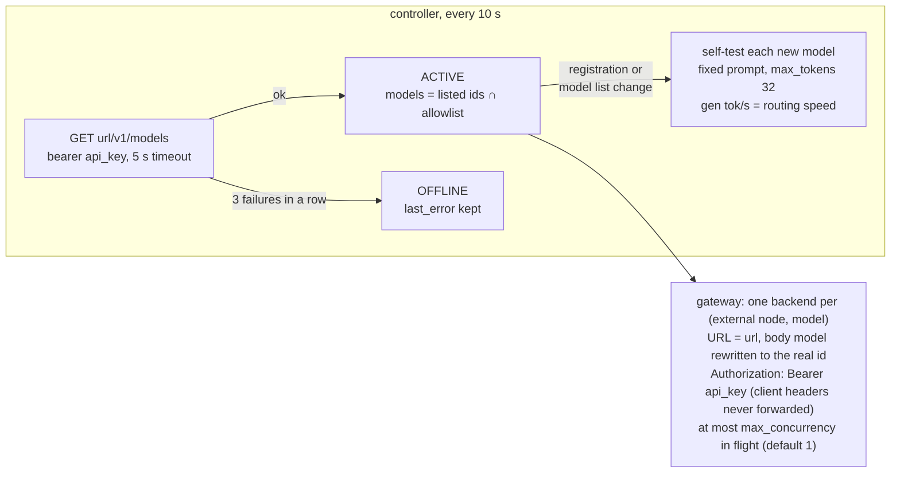
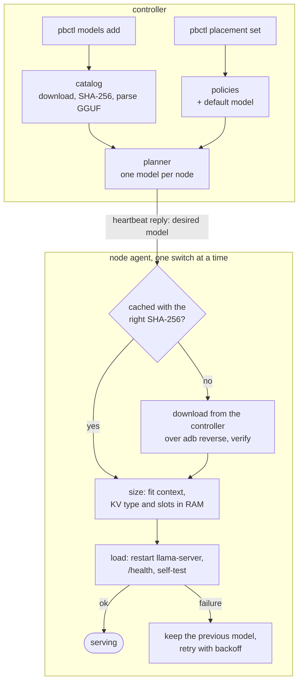
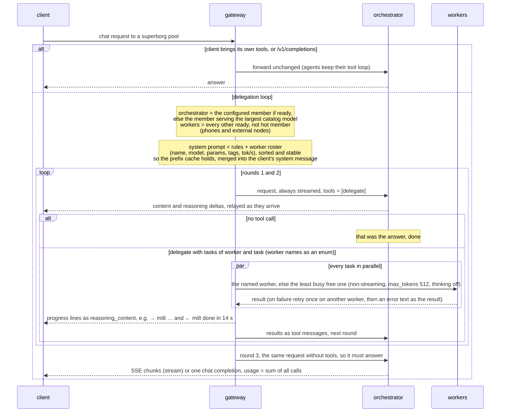
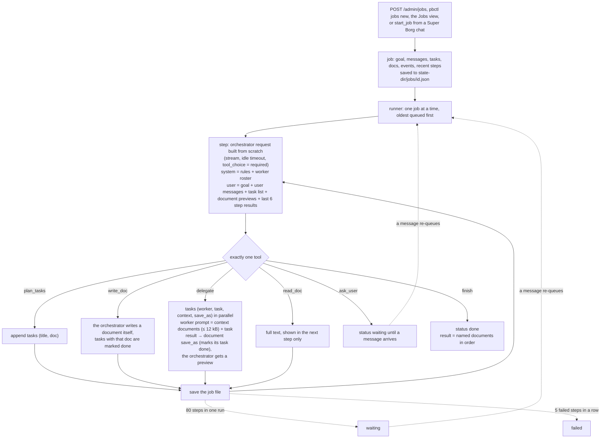
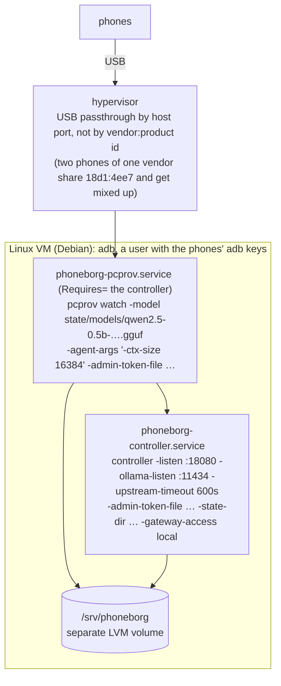

# Architecture

How PhoneBorg works today. For *why* it works this way, follow the ADR links
into [DECISIONS.md](DECISIONS.md). For measurements, see
[BENCHMARKS.md](BENCHMARKS.md).

## Contents

- [Overview](#overview)
- [Components](#components)
- [Provisioning over adb](#provisioning-over-adb)
- [Node lifecycle](#node-lifecycle)
- [Request routing](#request-routing)
- [External engine nodes](#external-engine-nodes)
- [Model placement and switching](#model-placement-and-switching)
- [Performance tiers and resident bytes](#performance-tiers-and-resident-bytes)
- [Persistence](#persistence)
- [Ports](#ports)
- [Super Borg pools](#super-borg-pools)
- [Super Borg jobs](#super-borg-jobs)
- [Production deployment](#production-deployment)
- [Security model](#security-model)
- [Known limitations](#known-limitations)

## Overview



Everything the phones do goes over the USB cable: the agent talks to
`127.0.0.1:18080` on the phone, which `adb reverse` maps to the controller,
and the controller reaches each phone's llama-server through an `adb forward`
on the host (ADR-003, ADR-006).

## Components

### Controller (`controller/`, binary `controller`)

| Part | Code | Role |
|---|---|---|
| Registry | `controller/registry.go` | Nodes by id, inventory, last heartbeat, lifecycle state, drain flags and aliases (kept by node id, so they survive re-registration). |
| Gateway | `controller/gateway` | OpenAI-compatible `/v1/chat/completions`, `/v1/completions`, `/v1/models`. Authenticator, target resolution, `Picker`s (`Affinity`, `LeastInflight`, `Spread`), failover, reaping, token and usage accounting, prewarm. |
| Super Borg jobs | `controller/gateway/jobs.go`, `controller/jobs_admin.go` | Background jobs for long, multi-step work: task list, document workspace, stateless orchestrator steps, persisted per job (ADR-021). |
| Super Borg | `controller/gateway/superborg.go`, `controller/pools.go` | Pools with routing `superborg`: the pool answers as one model; an orchestrator member delegates subtasks to the other members through a `delegate` tool, the gateway runs them in parallel (ADR-020, ADR-022). |
| Admin API | `controller/admin.go`, `models_admin.go`, `pools.go`, `external.go` | `/admin/...` JSON API behind a bearer token: nodes, drain, keys, stats, gateway settings, models, placement, pools, aliases, prewarm, external nodes (ADR-008). |
| External nodes | `controller/external.go` | Operator-added OpenAI-compatible servers (LM Studio, oMLX, Ollama, llama-server on a Mac or PC): health and model polling, self-tests, backends for the gateway (ADR-016). |
| Catalog | `controller/models` | Downloads GGUF files (`hf://`, `https://`, `file://`), resumes, hashes, reads GGUF metadata, computes RAM estimate and `resident_bytes` (ADR-011, ADR-012 update). |
| Planner | `controller/models/planner.go` | Pure function from policies, default model, nodes and ready models to one model per node (ADR-011, ADR-015). |
| Performance | `controller/perf.go`, `controller/models/perf.go` | Per-node effective bandwidth, performance tier, predicted tok/s (ADR-015). |
| Usage store | `controller/usage.go` | Requests, errors and tokens per API key and per node, since start and, with `-state-dir`, since first use. |
| Web panel | `controller/ui` | Static HTML/JS embedded in the binary, served at `/ui/`; an admin API client like `pbctl` (ADR-013). |
| Metrics | `/metrics` | `phoneborg_*` Prometheus metrics. |

`pbctl` (`controller/cmd/pbctl`) is the admin CLI. It imports the admin API's
types from `controller`, so the two cannot drift apart.

### Node agent (`node-agent/`, binary `node-agent`)

A static Go binary pushed to `/data/local/tmp/phoneborg` and started over adb
as the `shell` user (ADR-001).

| Part | Code | Role |
|---|---|---|
| Inventory | `inventory.go` | SoC, ABI, cores, RAM, storage, battery, temperature from `getprop`, `/proc`, `/sys`, `dumpsys`, capped by cgroup limits (so emulated phones report their container limits). Every probe degrades to "unknown". |
| Benchmark | `bench.go` | A short synthetic CPU/memory benchmark (`synthetic-go-v0`) at startup, before llama-server starts. Only a fallback for routing. |
| Runtime supervisor | `runtime.go` | Runs llama-server, restarts it with backoff, probes `/health`, runs the self-test after every (re)start (ADR-010). |
| Model manager | `manager.go`, `download.go` | Applies the controller's desired model: download, verify, size, load, fall back (ADR-012). |
| Memory sizing | `sizing.go`, `internal/memplan` | Picks context, slots and KV cache type that fit the RAM budget; shared with the planner. |
| Thread choice | `cpu.go` | `-threads-policy all` (default) or `big`, capped by usable cores (ADR-009). |
| Self-test | `runtime.go` | Fixed ~100-token prompt, 32 generated tokens, no prompt cache; reports prompt and generation tok/s. |

### Provisioner (`provisioner/`, binary `pcprov`)

`pcprov` checks the ABI, reads `/proc/cpuinfo` and picks the fastest
llama.cpp build the CPU supports (`bin/llama/<ARM_ARCH>/`, ADR-007), pushes
the agent, llama-server and an optional model, sets up the adb links and
starts the agent detached. `watch` does this for every device that appears
(polling every 3 s) and re-checks adb links every 15 s. `slim`/`unslim`
reversibly disable user-facing apps to free RAM.

### Monitoring (`deploy/`)

`make cluster-up` starts the controller, Prometheus (scrapes
`controller:18080/metrics` every 5 s; retention 15 days or 1 GB) and Grafana
with the provisioned "PhoneBorg" dashboard, plus two emulated phones.

## Provisioning over adb



`adb` drops forward and reverse rules when a phone re-enumerates on USB (a
loose cable, a hot phone) while it stays listed. `pcprov watch` restores them
on the same host port the agent advertises; `pcprov heal -serial S` does it
once.

## Node lifecycle



- The controller asks for heartbeats every 5 s (`-heartbeat-interval`), so
  `SUSPECT` comes after 15 s and `OFFLINE` after 30 s by default
  (`-suspect-after-missed 3`, `-offline-after-missed 6`).
- A heartbeat from an id the controller does not know (e.g. after a
  controller restart) gets an error, and the agent registers again. After
  three failed heartbeats in a row the agent also starts over, with backoff
  up to 30 s.
- **Drain** is a flag, not a state: a drained `ACTIVE` node gets no new
  requests, but running ones finish. **Hot** (temperature ≥ thermal limit)
  and **switching** (downloading or loading a model) are also per-node
  conditions checked at routing time.
- `pbctl forget` removes a node; if it is still running it registers again
  on its next heartbeat.

## Request routing



| Picker | How it chooses |
|---|---|
| Affinity (default) | the same prompt prefix (first message + tools) goes to the same node; a pinned node that is at least `spill` (2) busier or hot is skipped; new large sessions (≥ 16 KiB) go to the least busy node with the fewest large sessions, then the fastest (self-test tok/s) |
| LeastInflight | fewest in-flight requests |
| Spread (pools) | fewest in-flight, then fastest, then rotation; no pins |

Hot nodes get no new sessions unless every candidate is hot.

- **Semantic router (ADR-033, experimental, off by default).** Before
  routing an `auto` request, the gateway asks the least busy node of the
  classifier target for one token: a system prompt built from the
  router's classes (cached by llama-server) plus the last user message,
  with `max_tokens: 1` and `top_logprobs`. Class i answers with letter i;
  the most probable class's target (pool, node, model or `auto`) replaces
  `auto`, and the normal path below continues from it, Super Borg pools
  included. Any failure keeps plain `auto`. `X-Phoneborg-Route` names the
  class or `fallback`. The router and its classes are stored in
  `routing.json`.

- **Reaping.** Every second the controller sweeps node states and cancels
  in-flight requests on nodes that left the ready set (e.g. `SUSPECT`); those
  requests are retried elsewhere instead of waiting for the timeout. Drained
  nodes are not reaped.
- A node that rejects a prompt as too long for its context is not marked down;
  the request just tries another node.
- Once response bytes have reached the client, a request cannot be retried.
- `X-PhoneBorg-Node` on the response names the node that answered.
- Rationale: ADR-006 (gateway, affinity, failover), ADR-010 (measured speed,
  thermal), ADR-014 (targets, pools, spread), ADR-033 (semantic router).

## External engine nodes

An operator can add any OpenAI-compatible server as a node with
`PUT /admin/external/<name>` (`pbctl external add`). The gateway sees it as
node id `ext:<name>` with alias `<name>`; it has no agent, heartbeats,
inventory or RAM class, and the planner never assigns it a model (ADR-016).



External nodes take part in `auto`, pools (node filters match `<name>` or
`ext:<name>`; class filters never match them), `node/<name>`, plain model
ids, affinity, failover, reaping when they turn `OFFLINE`, drain, usage and
every per-node gateway metric. `node/<name>` goes to the node's first model
(allowlist order, else the order the server lists). They are not in
`/admin/nodes`, `/admin/placement` or the device class counts.

## Model placement and switching



- **Catalog.** `pbctl models add hf://…` downloads with resume and 3
  retries, hashes the file (SHA-256), parses the GGUF and records size,
  `resident_bytes`, layers and KV heads before the model is ready.
- **Planner.** Runs on every change (policies, node join/leave/drain, a model
  becoming ready) and every 10 s. Order: pins → replicas → percent → default
  model → otherwise keep what the node serves. A model is eligible on a node
  if it fits (node budget, or the class heuristic before the first
  heartbeat) and its predicted tok/s ≥ `min_tok_s` (unknown never excludes;
  pins always place).
- **Heartbeat reply.** `200` with the desired model id, URL, SHA-256, size,
  resident bytes, `ctx 16384` (≤ trained), 1 slot, KV type `auto` and the
  GGUF shape; `204` means no change. The latest desired state wins.
- **Download.** `statfs`, then evict other `.gguf` files least recently used
  first (never the served one), then `GET /v1/model-files/<id>` over
  `adb reverse` into `models/<id>.gguf.part` with HTTP Range resume, verify
  SHA-256, rename.
- **Sizing.** Budget = `MemAvailable` + `RssAnon(llama-server)` − 600 MiB
  (`-mem-reserve-mb`); try f16 KV → q8_0 KV → halve the context to 4096 →
  1 slot → fail.
- **Load.** Stop the old llama-server, start the new one, wait for
  `/health` (2 min), run the self-test. State goes downloading → loading →
  serving; the gateway skips switching nodes.
- **Failure.** Keep or restart the previous model, state `error`, retry the
  same desired state after 30 s, doubling to 10 min (sooner if the budget
  grows by more than 10%).

A node provisioned with `pcprov -model FILE` serves that file until the
controller sends a desired model. If the requested settings do not fit but
the same model is already running, the agent keeps the running instance
instead of failing. Rationale: ADR-011 (catalog, planner, delivery) and
ADR-012 (agent side).

## Performance tiers and resident bytes

- **RAM class** (`xs` < 3 GiB, `s` 3–5, `m` 5–7, `l` 7–10, `xl` 10+) says
  whether a model can fit.
- **Performance tier** says whether it runs fast enough. The controller
  computes `gen_gbps = self-test gen tok/s × resident bytes of the served
  model / 1e9` on every heartbeat, keeps the last good value per node (also
  across restarts, in `routing.json`) and maps it to `t1` < 4, `t2` 4–10,
  `t3` 10–25, `t4` ≥ 25 GB/s, or `?` before the first self-test.
- **Predicted speed** of a candidate model on a node is
  `gen_gbps × 1e9 / resident_bytes`. The planner will not place a model
  where the prediction is below the policy's `min_tok_s` or
  `-min-predicted-tok-s` (default 3).
- **Resident bytes** are the file size minus tensors llama.cpp reads only a
  few rows of through mmap (today: `per_layer_token_embd.weight`, as in
  Gemma 3n). Sizing adds 10% of those sparse bytes back. The same number is
  used for fit checks, agent sizing, bandwidth and prediction.

Rationale: ADR-011, ADR-012 update, ADR-015. Numbers: [BENCHMARKS.md](BENCHMARKS.md#effective-bandwidth-and-performance-tiers).

## Persistence

With `-state-dir DIR` the controller keeps:

| File | Contents | Written |
|---|---|---|
| `DIR/usage.json` | usage totals per key and node since first use | every 30 s and on SIGINT/SIGTERM; a corrupt file stops startup |
| `DIR/models.json` | model catalog | on change |
| `DIR/placement.json` | placement policies and the default model | on change |
| `DIR/routing.json` | node aliases, pools (Super Borg pools included), per-node measured bandwidth | on change (atomic, mode 0600) |
| `DIR/mmb/<id>.json` | multi-model benchmark runs and results | after every result (atomic, mode 0600) |
| `DIR/admin-tokens` | named admin tokens as SHA-256 hashes (`-admin-tokens-file` overrides) | on create/revoke (atomic, mode 0600) |
| `DIR/jobs/<id>.json` | Super Borg jobs: goal, messages, tasks, documents, events | after every step (atomic, mode 0600) |
| `DIR/external.json` | external nodes with their API keys and self-test results | on change (atomic, mode 0600) |
| `DIR/models/` | downloaded GGUF files (`-models-dir` overrides) | by the catalog |

Elsewhere:

| What | Where |
|---|---|
| API keys (hashed) | the `-api-keys-file` file, if given; otherwise memory only |
| Admin token | the `-admin-token-file` file (only its SHA-256 is kept in memory) |
| Not persisted | drain flags (phones and external nodes), runtime gateway settings (policy, spill, timeout, thermal limit, auth mode) |
| On each phone | `/data/local/tmp/phoneborg`: `node-agent`, `bin/llama-server`, `models/*.gguf`, `agent.log`/`agent.pid`, `runtime.log`/`runtime.pid`, `slim.state` |

Without `-state-dir` everything lives in memory and model files go to a
temporary directory. The compose stack uses `-state-dir /var/lib/phoneborg`
on the `controller-state` volume.

## Ports

| Port | Where | What |
|---|---|---|
| 18080 | host | controller: gateway `/v1`, admin `/admin`, `/ui/`, `/status`, `/metrics`, `/healthz` (`-listen`) |
| 18080 | phone | `adb reverse` to the controller (`pcprov -controller-port`) |
| 18090 | phone, 127.0.0.1 only | llama-server (`pcprov -serve-port`, agent `-serve-port`) |
| ephemeral | host | `adb forward` to each phone's 18090, chosen by adb and reused on re-provisioning; the controller reaches it on `-backend-host` (default 127.0.0.1, `host.docker.internal` in compose) |
| 18091 | phone | `tests/e2e/llm_smoke.sh` test server, so it does not disturb the agent |
| 9090 | host | Prometheus (compose) |
| 3000 | host | Grafana (compose) |
| 5555, 5556 | host | adb of the emulated phones `phone-low`, `phone-mid` (compose) |

## Super Borg pools

A pool with routing `superborg` (ADR-022) is a single model made of its
members. A chat request to it runs this loop; other targets are routed as
usual (ADR-020):



- Every orchestrator and worker call goes through the normal `forward`
  path, so in-flight accounting, reaping of lost nodes, per-node metrics
  and usage work as for any request.
- If the orchestrator fails before any byte reached the client, the next
  node in the same order (largest model) takes over, with a roster rebuilt
  for the new set of workers. After output has started, an error ends the
  stream with a bracketed message.
- Like every call, orchestrator and worker calls wait up to
  `-first-token-timeout` for the first byte, then at most
  `-upstream-timeout` of silence, so a model that keeps generating is not
  cut off (ADR-024).
- Thinking (`enable_thinking`) is off for the orchestrator by default and
  always off for workers: on phones every token costs, and worker results
  become the orchestrator's prompt, processed at roughly 10–20 tok/s.
- The mode, the orchestrator and the thinking flag are stored in
  `routing.json`.

Measured on the four-phone cluster (OnePlus 10 Pro orchestrating with
Qwen3-8B at ~3.7 tok/s; Mi 8, POCO F3 and Pixel 8 Pro as workers): a
request with three independent parts ran its subtasks in parallel in
10–85 s, and took about 6 minutes in total, most of it the orchestrator
generating the final answer. A 4B orchestrator answers the same request in
about 2 minutes, with clearly worse planning.

## Super Borg jobs



The design keeps the orchestrator's context constant instead of letting a
chat history grow: what matters between steps lives in the job (task
statuses, documents), and the orchestrator re-reads a compact view of it
every step. Large texts never pass through the orchestrator unless it asks
for them with `read_doc`. Rationale: ADR-021.

## Production deployment

The reference deployment is one Linux VM next to the phones; the phones
reach it only over USB.



```text
/srv/phoneborg            separate LVM volume (models are tens of GB)
├─ app/                   source tree + bin/ (controller, pbctl, pcprov,
│                         node-agent-android-arm64, llama/<variant>/llama-server)
├─ state/                 -state-dir: routing.json, placement.json, models.json,
│                         usage.json, external.json, devices.json, models/*.gguf
└─ admin-token            mode 0600
```

- **Bootstrap model.** pcprov pushes one small GGUF with the agent, so a
  new phone serves something within minutes; the planner then switches it
  to its planned model, which the agent downloads from the controller
  (`/v1/model-files/<id>` over `adb reverse`), not over adb push.
- **Upgrading.** Sync the source tree to `app/`, `make controller pbctl`
  (Go is installed on the VM; llama.cpp binaries are built elsewhere with
  Docker and copied to `bin/llama`), then `systemctl restart
  phoneborg-controller`. Agents re-register within seconds and keep
  serving; state is reloaded from `state/`.
- **Do not restart the controller while a phone is downloading a model**:
  the download runs over the controller's HTTP server and breaks. The agent
  resumes it from the partial file (HTTP Range) once it has re-registered.
- **Cooling and power.** A phone at or above `-thermal-limit-c` gets no new
  sessions, but an explicitly chosen node (`node/<alias>`, the configured
  orchestrator of a Super Borg pool) still serves; a hot phone throttles hard (the
  OnePlus 10 Pro dropped from ~3.7 to ~1 tok/s at 79 °C). Keep phones
  charged and ventilated.

## Security model

PhoneBorg is a proof of concept for localhost or a trusted network. There is
no TLS anywhere yet.

| Surface | Protection |
|---|---|
| Gateway `/v1/chat/completions`, `/v1/completions`, `/v1/models` | open (served as `anonymous`) without `-api-keys-file`; with it, `Authorization: Bearer <key>` or `x-api-key` is required. Keys are stored as SHA-256 hashes; plaintext is shown once at creation (ADR-008). |
| Admin API `/admin/...` | disabled (503) unless `-admin-token-file` is set; then a bearer token: that file's token (`admin`, ≥ 16 characters) or a named token from `-admin-tokens-file` (ADR-026), all compared by hash in constant time. Every call is counted in `phoneborg_admin_actions_total`, every change logged with the token's name. |
| Web panel `/ui/` | static files, no data; it uses the admin token (kept in the tab's `sessionStorage`). Strict CSP, no external resources (ADR-013). |
| Node protocol `/v1/register`, `/v1/benchmark`, `/v1/heartbeat` | **unauthenticated** in v0: phones reach it only through `adb reverse` on the adb host (ADR-002, ADR-003). |
| `/v1/nodes`, `/status`, `/metrics`, `/healthz` | **unauthenticated**, read-only |
| `/v1/model-files/<id>` | **unauthenticated**, same trust as the heartbeat: anything that reaches the port can download catalog models, including `file://` sources (ADR-011). |
| llama-server on the phone | bound to the phone's 127.0.0.1, reachable only through `adb forward` |
| External nodes (ADR-016) | the controller sends each its own API key, if set; the key is stored in `external.json` (mode 0600), never returned by the admin API and never logged. A client's PhoneBorg key is never forwarded. The external server's own exposure is the operator's responsibility. |

Why unauthenticated in v0: the node protocol is meant to move to gRPC + mTLS
before any non-localhost deployment (ADR-002). Until then, keep port 18080 on
localhost or a trusted network and do not expose it to untrusted networks.
`deploy/dev-admin-token` is public and for development only.

## Known limitations

- Phones must stay on USB to the adb host; no Wi-Fi nodes yet (ADR-003).
- The agent is started over adb and does not survive a phone reboot;
  `pcprov watch` re-provisions when the phone is plugged in (ADR-001).
- One model per phone; no model split across phones.
- CPU only (static musl llama.cpp, no GPU/NPU backends, ADR-005).
- One admin role: named admin tokens (ADR-026) identify who acted but all
  have the same rights; keys have no scopes, expiry or
  quotas (ADR-008).
- Drain flags and runtime gateway settings are lost on controller restart.
- Hugging Face gated repositories and split GGUF files are not supported
  (ADR-011).
- Thermal routing looks at the last heartbeat only (a soft limit, ADR-010).
- Performance prediction is a single bandwidth number per node; it ignores
  attention variants and MoE (ADR-015).
- External nodes are not managed: no placement, no downloads, no thermal
  data. Requests beyond an external node's `max_concurrency` are not queued;
  they go elsewhere or get 503 `busy` (ADR-016).
- Super Borg (ADR-020) multiplies latency: plan, parallel subtasks and a
  synthesis round, each with phone-speed prompt processing. Small
  orchestrators sometimes delegate dependent steps in the same round and
  pass on wrong worker answers; the rules in the system prompt reduce this
  but do not enforce it.
