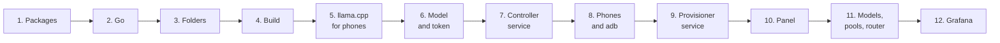

# Install: a permanent cluster with the web panel, step by step

This guide installs PhoneBorg as a service on a Linux host (a small PC, a
NUC or a VM with USB passthrough), from an empty Debian or Ubuntu system to
a cluster that starts at boot, provisions phones as they are plugged in and
is managed from the web panel, with Grafana dashboards inside the panel.
Every step ends with a check. It follows the reference deployment
([ARCHITECTURE.md](ARCHITECTURE.md#production-deployment)) and takes about
an hour, most of it downloads and builds.

For a quick try on a laptop without services, use
[QUICKSTART.md](QUICKSTART.md) instead.



What you end up with:

| Piece | Where |
|---|---|
| OpenAI-compatible endpoint | `http://<host>:18080/v1` (Ollama API on `:11434`) |
| Web panel | `http://<host>:18080/ui/` |
| Services | `phoneborg-controller`, `phoneborg-pcprov` (systemd), Prometheus, Grafana |
| Files | `/srv/phoneborg/app` (code and binaries), `/srv/phoneborg/state` (models, settings), `/srv/phoneborg/admin-token` |
| Config templates | [`deploy/host/`](../deploy/host/) in this repository |

## What you need

| | Minimum | Notes |
|---|---|---|
| Host | Debian 12/13 or Ubuntu 22.04/24.04, x86-64 or arm64, 2 CPU, 4 GB RAM | the reference host is a Debian 13 VM with 4 vCPU, 3.8 GB RAM |
| Disk | 50 GB free for `/srv/phoneborg` | models are 0.5–5 GB each; a separate volume is best |
| Phones | ARM64 Android, USB debugging, 4 GB RAM or more | see [REAL_PHONES.md](REAL_PHONES.md) for which phones and models fit |
| USB | data cables and a powered hub (2–3 A per port) | VM: pass USB through by host port, not by vendor:product id |
| Internet | for packages, Go, models from Hugging Face | |

In the commands below, `$USER` is the account that runs the services and
owns the phones' adb key; use one normal user (not root) throughout.

## 1. System packages

```sh
sudo apt update
sudo apt install -y git make curl ca-certificates openssl adb rsync
sudo usermod -aG plugdev "$USER"     # USB access to phones (log out and in afterwards)
```

The `adb` package brings the udev rules for Android devices. On Ubuntu
the package is also called `adb`; `android-sdk-platform-tools` works too.

**Check:** `adb version` prints a version; `groups` lists `plugdev` after
you log in again.

## 2. Go

PhoneBorg needs Go 1.25 or newer; Debian 13 and Ubuntu 24.04 ship older
versions, so install it from go.dev:

```sh
GO_VERSION=1.27.1
ARCH=$(dpkg --print-architecture)          # amd64 or arm64
sudo rm -rf /usr/local/go
curl -fsSL "https://go.dev/dl/go${GO_VERSION}.linux-${ARCH}.tar.gz" | sudo tar -C /usr/local -xz
echo 'export PATH=$PATH:/usr/local/go/bin' >> ~/.profile
export PATH=$PATH:/usr/local/go/bin
```

**Check:** `go version` prints `go1.27.1` (or the version you chose).

## 3. Folders

Everything lives under `/srv/phoneborg`. Mount a separate disk or volume
there first if you have one.

```sh
sudo mkdir -p /srv/phoneborg/state/models
sudo chown -R "$USER": /srv/phoneborg
```

**Check:** `touch /srv/phoneborg/x && rm /srv/phoneborg/x` works without
sudo.

## 4. Get the code and build

```sh
git clone https://github.com/dzaczek/phoneborg /srv/phoneborg/app
cd /srv/phoneborg/app
make all          # runs the tests, then builds bin/controller, bin/pcprov, bin/pbctl and the phone agent
```

**Check:** `ls bin/` shows `controller`, `pcprov`, `pbctl` and
`node-agent-android-arm64`.

## 5. llama.cpp for the phones

The phones run llama.cpp built as static arm64 binaries in three CPU
variants. Build them with Docker, on this host or on another machine.

**Option A: on this host.** Install Docker from Docker's repository (it
includes the `buildx` plugin the build needs):

```sh
sudo install -m 0755 -d /etc/apt/keyrings
. /etc/os-release                                     # sets ID (debian/ubuntu) and VERSION_CODENAME
sudo curl -fsSL "https://download.docker.com/linux/${ID}/gpg" -o /etc/apt/keyrings/docker.asc
echo "deb [arch=$(dpkg --print-architecture) signed-by=/etc/apt/keyrings/docker.asc] https://download.docker.com/linux/${ID} ${VERSION_CODENAME} stable" \
  | sudo tee /etc/apt/sources.list.d/docker.list
sudo apt update
sudo apt install -y docker-ce docker-ce-cli containerd.io docker-buildx-plugin
sudo usermod -aG docker "$USER"                       # log out and in afterwards
```

On an **x86-64** host the arm64 build runs under QEMU; register it once
(an arm64 host skips this):

```sh
docker run --privileged --rm tonistiigi/binfmt --install arm64
```

Then build (10–20 minutes natively, about an hour under QEMU):

```sh
cd /srv/phoneborg/app
make llama-all
```

**Option B: on another machine** (a Mac with Apple Silicon, or any arm64
Linux box with Docker and buildx), then copy the result:

```sh
make llama-all                                         # on that machine, in a clone of the repository
rsync -a bin/llama/ <user>@<host>:/srv/phoneborg/app/bin/llama/
```

**Check:** `file /srv/phoneborg/app/bin/llama/*/llama-server` reports
`ARM aarch64, statically linked` for all three directories
(`armv8.2-a+dotprod+fp16`, `armv8.2-a+fp16`, `armv8-a`).

## 6. Bootstrap model and admin token

The provisioner pushes one small model with the agent, so a new phone
serves something within minutes; later you give each phone a better model
from the panel.

```sh
curl -fL -o /srv/phoneborg/state/models/qwen2.5-0.5b-instruct-q4_k_m.gguf \
  https://huggingface.co/Qwen/Qwen2.5-0.5B-Instruct-GGUF/resolve/main/qwen2.5-0.5b-instruct-q4_k_m.gguf
(umask 077; openssl rand -hex 32 > /srv/phoneborg/admin-token)
```

The admin token signs you in to the panel and `pbctl`. Keep it secret;
`cat /srv/phoneborg/admin-token` shows it when you need it.

**Check:** the model is about 490 MB; `ls -l /srv/phoneborg/admin-token`
shows `-rw-------`.

## 7. Controller service

```sh
cd /srv/phoneborg/app
sed "s/__USER__/$USER/" deploy/host/phoneborg-controller.service \
  | sudo tee /etc/systemd/system/phoneborg-controller.service
sudo systemctl daemon-reload
sudo systemctl enable --now phoneborg-controller
```

Before or after starting it, look at the flags in
`/etc/systemd/system/phoneborg-controller.service`:

| Flag | Default in the template | Change it when |
|---|---|---|
| `-trusted-cidrs` | `127.0.0.0/8,::1/128` | other machines on your LAN should use the endpoint without an API key: add the LAN, e.g. `127.0.0.0/8,::1/128,192.168.1.0/24` |
| `-gateway-access` | `local` | `keys` requires an API key from everyone; see [OPERATIONS.md](OPERATIONS.md#access-control) |
| `-grafana-url` | `http://127.0.0.1:3000` | remove it if you skip step 12 |
| `-firmware-check` | on | remove it if the host has no internet |
| `-upstream-timeout` | `600s` | rarely; see [OPERATIONS.md](OPERATIONS.md#gateway-settings) |

After editing: `sudo systemctl daemon-reload && sudo systemctl restart phoneborg-controller`.
All flags: `bin/controller -h` and [OPERATIONS.md](OPERATIONS.md#starting-the-controller).

**Check:**

```sh
systemctl is-active phoneborg-controller      # active
curl -s http://127.0.0.1:18080/healthz        # ok
journalctl -u phoneborg-controller -n 20      # JSON log lines, no errors
```

If a firewall is on, open the controller port to your LAN, e.g. with ufw:
`sudo ufw allow from 192.168.1.0/24 to any port 18080 proto tcp`.

## 8. Phones and adb

For each phone (details and vendor quirks in [REAL_PHONES.md](REAL_PHONES.md#1-prepare-the-phone-once-per-phone)):

1. Settings → About phone → tap **Build number** 7 times.
2. Developer options → **USB debugging** on (Xiaomi, Redmi, POCO: also
   **USB debugging (Security settings)**).
3. Take it out of its case, plug it in, unlock it.
4. As `$USER` (the account in the service files, not root), run
   `adb devices`, then tap **Allow** on the phone with **Always allow from
   this computer** ticked.

**Check:** `adb devices -l` lists every phone as `device`, not
`unauthorized` or `no permissions` (that one means the udev rules or the
`plugdev` group are missing: log in again or replug).

## 9. Provisioner service

```sh
cd /srv/phoneborg/app
sed "s/__USER__/$USER/" deploy/host/phoneborg-pcprov.service \
  | sudo tee /etc/systemd/system/phoneborg-pcprov.service
sudo systemctl daemon-reload
sudo systemctl enable --now phoneborg-pcprov
```

It installs the agent, the right llama.cpp variant and the bootstrap
model on every phone that is plugged in, now and later, and repairs the
USB links when a phone drops off.

**Check** (within one or two minutes):

```sh
export PHONEBORG_ADMIN_TOKEN=$(cat /srv/phoneborg/admin-token)
/srv/phoneborg/app/bin/pbctl nodes            # BENCHMARKING, then ACTIVE with a TOK/S value
curl -s http://127.0.0.1:18080/v1/chat/completions \
  -d '{"model":"auto","messages":[{"role":"user","content":"Hello from a phone cluster!"}]}'
```

`journalctl -u phoneborg-pcprov -f` shows the provisioning as it happens.
Keep phones awake on USB: `adb -s <serial> shell svc power stayon usb`.

Tip: put `export PHONEBORG_ADMIN_TOKEN=$(cat /srv/phoneborg/admin-token)`
and `export PATH=$PATH:/srv/phoneborg/app/bin` in `~/.profile`, so `pbctl`
works in every shell.

## 10. The web panel

Open `http://<host>:18080/ui/` from any machine that reaches the host and
sign in with the admin token. The token stays in that browser tab only.

| View | What you do there |
|---|---|
| Overview | cluster health at a glance |
| Nodes | phones, their state, temperature, speed; drain, alias, details |
| Devices | USB devices seen by the provisioner; auto-provision on/off |
| Models, Placement | add models from Hugging Face, choose defaults; which phone serves what |
| Pools | groups of phones for agents, Super Borg pools |
| Jobs | long Super Borg jobs |
| Proxy | gateway settings, the semantic router and its classes, API key enforcement |
| API keys, Usage | keys for clients; usage per key and phone |
| Chat | talk to a model, a pool or one phone |
| Dashboards, Tokens | Grafana inside the panel (after step 12), token counts per model |

**Check:** Nodes lists your phones as ACTIVE; Chat answers.

## 11. Models, pools and the router

The bootstrap model only proves the setup. Give the phones real models
(from the panel's **Models** view or with `pbctl`):

```sh
# phones with 4–6 GB RAM
pbctl models add hf://Qwen/Qwen2.5-1.5B-Instruct-GGUF/qwen2.5-1.5b-instruct-q4_k_m.gguf
# 8 GB and more: better answers and reliable tool calling
pbctl models add hf://unsloth/Qwen3-4B-Instruct-2507-GGUF/Qwen3-4B-Instruct-2507-Q4_K_M.gguf -tag general,tools
pbctl models default qwen3-4b-instruct-2507-q4_k_m
pbctl placement          # each phone: downloading → loading → serving
```

The controller sizes each model to each phone's RAM; phones that cannot
hold the default keep a smaller one. Then, as needed:

- **Aliases:** `pbctl nodes alias <id> pixel` so a phone is `node/pixel`.
- **Pools:** groups of phones for agents and Super Borg
  ([OPERATIONS.md](OPERATIONS.md#virtual-models-pools-and-aliases)).
- **Semantic router:** send each `auto` request to the right pool by its
  kind, from the panel's **Proxy** view or `pbctl gateway set router=on
  router_classifier=node/<a Qwen3 phone>` and `pbctl router class set …`
  ([OPERATIONS.md](OPERATIONS.md#semantic-router-experimental)).

**Check:** `pbctl placement` shows every phone `serving` its planned model.

## 12. Monitoring: Prometheus and Grafana (optional)

Grafana's dashboards appear inside the panel (**Dashboards**, **Tokens**,
per-node charts); the controller serves Grafana under `/grafana/`, so no
second port or login is needed.

Prometheus from the distribution, Grafana from Grafana's repository:

```sh
sudo apt install -y prometheus gpg
sudo mkdir -p /etc/apt/keyrings
curl -fsSL https://apt.grafana.com/gpg.key | gpg --dearmor | sudo tee /etc/apt/keyrings/grafana.gpg > /dev/null
echo "deb [signed-by=/etc/apt/keyrings/grafana.gpg] https://apt.grafana.com stable main" \
  | sudo tee /etc/apt/sources.list.d/grafana.list
sudo apt update && sudo apt install -y grafana
```

Configure them with the templates (replace `<controller-ip>` with the
address you open the panel at, e.g. `192.168.1.20`):

```sh
cd /srv/phoneborg/app
sudo cp deploy/host/prometheus.yml /etc/prometheus/prometheus.yml
sudo cp deploy/host/grafana-datasource.yml /etc/grafana/provisioning/datasources/phoneborg.yml
sudo cp deploy/host/grafana-dashboards.yml /etc/grafana/provisioning/dashboards/phoneborg.yml
sudo mkdir -p /etc/systemd/system/grafana-server.service.d
sed "s/__HOST__/<controller-ip>/" deploy/host/grafana-phoneborg.conf \
  | sudo tee /etc/systemd/system/grafana-server.service.d/phoneborg.conf
sudo systemctl daemon-reload
sudo systemctl restart prometheus
sudo systemctl enable --now grafana-server
```

Change Grafana's admin password (default `admin`/`admin`) the first time
you open **Open in Grafana**, or right away:
`sudo grafana cli admin reset-admin-password '<a new password>'`.

**Check:**

```sh
curl -s http://127.0.0.1:9090/api/v1/targets | grep -o '"health":"[a-z]*"'   # "health":"up"
systemctl is-active grafana-server                                            # active
```

In the panel, **Dashboards** shows the PhoneBorg dashboard with live data.

## Configuration files

| File | What it configures | Template |
|---|---|---|
| `/etc/systemd/system/phoneborg-controller.service` | controller flags: ports, access, state, Grafana | [`deploy/host/phoneborg-controller.service`](../deploy/host/phoneborg-controller.service) |
| `/etc/systemd/system/phoneborg-pcprov.service` | provisioner: bootstrap model, agent arguments | [`deploy/host/phoneborg-pcprov.service`](../deploy/host/phoneborg-pcprov.service) |
| `/srv/phoneborg/admin-token` | the admin token (0600) | step 6 |
| `/srv/phoneborg/state/` | everything changed at runtime: `routing.json` (aliases, pools, semantic router), `models.json`, `placement.json`, `external.json`, `devices.json`, `usage.json`, `models/`, `jobs/` | written by the controller |
| `/etc/prometheus/prometheus.yml` | scrape the controller every 5 s | [`deploy/host/prometheus.yml`](../deploy/host/prometheus.yml) |
| `/etc/grafana/provisioning/datasources/phoneborg.yml` | Prometheus as Grafana's data source | [`deploy/host/grafana-datasource.yml`](../deploy/host/grafana-datasource.yml) |
| `/etc/grafana/provisioning/dashboards/phoneborg.yml` | the PhoneBorg dashboards from the repository | [`deploy/host/grafana-dashboards.yml`](../deploy/host/grafana-dashboards.yml) |
| `/etc/systemd/system/grafana-server.service.d/phoneborg.conf` | Grafana under `/grafana/`, embedding, read-only anonymous view | [`deploy/host/grafana-phoneborg.conf`](../deploy/host/grafana-phoneborg.conf) |

Settings made in the panel or with `pbctl` (models, pools, aliases, the
router, keys) are stored in `/srv/phoneborg/state` and survive restarts.
The gateway settings on the **Proxy** form (policy, spill, timeouts,
thermal limit) are not: after a restart the controller uses its flags
again, so set lasting values with `-upstream-timeout`,
`-first-token-timeout` and `-thermal-limit-c` in the service file.

## Updating

```sh
cd /srv/phoneborg/app
git pull
make controller pbctl pcprov agent
sudo systemctl restart phoneborg-controller phoneborg-pcprov
```

Phones re-register within seconds and keep their models. Rebuild
llama.cpp (`make llama-all`) only when `LLAMA_TAG` in the Makefile
changes. Do not restart while a phone is downloading a model
(`pbctl placement`).

## Backup

Back up `/srv/phoneborg/state` without `models/` (models can be
downloaded again) and `/srv/phoneborg/admin-token`:

```sh
tar -C /srv/phoneborg --exclude=state/models -czf phoneborg-backup.tgz state admin-token
```

## Uninstall

```sh
sudo systemctl disable --now phoneborg-pcprov phoneborg-controller
sudo rm /etc/systemd/system/phoneborg-{controller,pcprov}.service
sudo systemctl daemon-reload
# on each phone: remove the agent and its files
adb -s <serial> shell rm -rf /data/local/tmp/phoneborg
sudo rm -rf /srv/phoneborg            # everything, models included
```

## If something is off

| Symptom | Look at | Usual fix |
|---|---|---|
| `adb devices` shows `no permissions` | udev rules, `plugdev` group | log out and in, replug; check `ls -l /dev/bus/usb/*/*` |
| `adb devices` shows `unauthorized` | the phone's screen | unlock, tap Allow as `$USER`; revoke and re-allow USB debugging if no prompt |
| `pbctl nodes` is empty | `journalctl -u phoneborg-pcprov -f` | phone not `device` in adb; pcprov service not running |
| pcprov: `serving file missing (make llama)` | `ls bin/llama/*/` | step 5 not done, or built for x86-64 (check with `file`) |
| node stays `BENCHMARKING` or turns `SUSPECT` | `pbctl nodes`, the phone's `runtime.log` | see [REAL_PHONES.md](REAL_PHONES.md#troubleshooting) |
| gateway answers 403 `remote_requires_api_key` | the client's address | add its network to `-trusted-cidrs` or give it an API key |
| panel Dashboards: 401 or empty | `-grafana-url`, step 12, `GF_SERVER_ROOT_URL` | the controller flag and Grafana's root URL must match the address in the browser |
| anything else | `journalctl -u phoneborg-controller` | [OPERATIONS.md](OPERATIONS.md#troubleshooting) |
