# Operating a cluster

This guide is for running a PhoneBorg cluster day to day: sending requests,
the web panel, `pbctl`, models and placement, virtual models, API keys,
draining, gateway settings, usage, the OpenCode agent bridge and monitoring.
To add phones, see [REAL_PHONES.md](REAL_PHONES.md); for emulated phones,
[DEV_EMULATION.md](DEV_EMULATION.md). How it works inside:
[ARCHITECTURE.md](ARCHITECTURE.md).

## Contents

- [Endpoints](#endpoints)
- [Starting the controller](#starting-the-controller)
- [Sending requests](#sending-requests)
- [Web panel](#web-panel)
- [pbctl reference](#pbctl-reference)
- [Models and placement](#models-and-placement)
- [Virtual models, pools and aliases](#virtual-models-pools-and-aliases)
- [API keys](#api-keys)
- [Draining a phone for maintenance](#draining-a-phone-for-maintenance)
- [Gateway settings](#gateway-settings)
- [Usage statistics](#usage-statistics)
- [OpenCode agent bridge](#opencode-agent-bridge)
- [Grafana and Prometheus](#grafana-and-prometheus)
- [Troubleshooting](#troubleshooting)

## Endpoints

The controller listens on `http://127.0.0.1:18080` by default (`-listen`).

| Path | What | Auth |
|---|---|---|
| `/v1/chat/completions`, `/v1/completions`, `/v1/models` | OpenAI-compatible gateway | API key when enforced |
| `/admin/...` | admin API, used by `pbctl` and the web panel | admin token |
| `/ui/` | [web panel](#web-panel) (`/` redirects here) | admin token (in the browser) |
| `/status` | read-only HTML table of nodes | none |
| `/v1/nodes` | nodes as JSON | none |
| `/v1/model-files/<model_id>` | model downloads for phones | none |
| `/metrics` | Prometheus metrics (`phoneborg_*`) | none |
| `/healthz` | liveness | none |

See [ARCHITECTURE.md](ARCHITECTURE.md#security-model) for why some paths are
open in v0. Keep the controller on localhost or a trusted network.

## Starting the controller

```sh
make controller pbctl
openssl rand -hex 32 > admin-token && chmod 600 admin-token
touch api-keys && chmod 600 api-keys      # optional: enforce API keys (empty = reject all until a key exists)
bin/controller -admin-token-file admin-token -api-keys-file api-keys -state-dir state/
```

| Flag | Default | Meaning |
|---|---|---|
| `-listen` | `:18080` | HTTP listen address |
| `-admin-token-file` | none | admin token file (≥ 16 characters, `#` comments allowed); none = admin API disabled |
| `-api-keys-file` | none | API keys file; none = open gateway (dev only). Reloaded on SIGHUP. |
| `-state-dir` | none | persistent state: `usage.json`, `models.json`, `placement.json`, `routing.json`, `models/` |
| `-models-dir` | `<state-dir>/models` | where catalog model files are stored |
| `-backend-host` | `127.0.0.1` | host where the phones' adb forwards are reachable |
| `-upstream-timeout` | `120s` | max duration of one proxied request |
| `-thermal-limit-c` | `75` | nodes at or above this temperature get no new sessions; 0 disables |
| `-min-predicted-tok-s` | `3` | planner will not place a model where predicted tok/s is lower |
| `-heartbeat-interval` | `5s` | heartbeat interval asked of nodes |
| `-suspect-after-missed` | `3` | missed heartbeats before `SUSPECT` |
| `-offline-after-missed` | `6` | missed heartbeats before `OFFLINE` |
| `-debug` | off | log every heartbeat |

The compose stack (`make cluster-up`) runs the controller with
`-backend-host host.docker.internal -upstream-timeout 600s`, the public
`deploy/dev-admin-token` and `-state-dir /var/lib/phoneborg` on the
`controller-state` volume.

## Sending requests

curl:

```sh
curl http://127.0.0.1:18080/v1/chat/completions \
  -H "Authorization: Bearer $PHONEBORG_API_KEY" \
  -d '{"model":"qwen2.5-0.5b-instruct-q4_k_m",
       "messages":[{"role":"user","content":"Hello from a phone cluster!"}]}'
```

Leave out the `Authorization` header while the gateway is open. Omitting
`model` picks any ready phone. The `X-PhoneBorg-Node` response header says
which phone answered.

OpenAI Python SDK:

```python
from openai import OpenAI

client = OpenAI(base_url="http://127.0.0.1:18080/v1", api_key="pb-...")  # any string while the gateway is open
resp = client.chat.completions.create(
    model="qwen2.5-0.5b-instruct-q4_k_m",
    messages=[{"role": "user", "content": "Write a haiku about old phones."}],
    stream=True,
)
for chunk in resp:
    print(chunk.choices[0].delta.content or "", end="", flush=True)
```

opencode, by hand (or let [`pbctl opencode init`](#opencode-agent-bridge)
write it): add a provider in `~/.config/opencode/opencode.jsonc` under
`"provider"`.

```jsonc
"phoneborg": {
  "npm": "@ai-sdk/openai-compatible",
  "name": "PhoneBorg (phones)",
  "options": { "baseURL": "http://127.0.0.1:18080/v1", "apiKey": "{env:PHONEBORG_API_KEY}",
               "timeout": false, "headerTimeout": 1800000, "chunkTimeout": 1800000 },
  "models": { "qwen2.5-0.5b-instruct-q4_k_m": {
    "name": "Qwen2.5 0.5B on phones", "limit": { "context": 16384, "output": 2048 } } }
}
```

Run `opencode -m phoneborg/qwen2.5-0.5b-instruct-q4_k_m`. opencode's default
build agent sends ~11.7k prompt tokens, so phones need a 16k context: models
placed by the controller get it automatically (when RAM allows); phones
provisioned with a static `-model` need `-agent-args "-ctx-size 16384"`.
Requests that share a system prompt and tools stay on one phone (session
affinity), so follow-up turns reuse its prompt cache: ~115 s for the first
turn, ~3 s after, on an emulated phone ([BENCHMARKS.md](BENCHMARKS.md#session-affinity-and-the-prompt-cache)).
A 0.5B model is too small for reliable tool use; it proves the integration,
not coding quality.

## Web panel

Open http://127.0.0.1:18080/ (redirects to `/ui/`). The panel needs the admin
API (`-admin-token-file`). Sign in with the admin token; it is kept for this
browser tab only (session storage) and sent as a bearer header. **Log out**
forgets it. The panel loads nothing from the internet. There is no TLS, so
use it on localhost or a trusted network.

| View | What it does |
|---|---|
| Overview | Nodes by state; ready, drained and hot nodes; requests/s and tokens/s (last 30 s, computed in the browser); errors; models served; placement warnings; a **Virtual models** card listing `/v1/models` by kind (`auto`, `pool/<name>` with eligible node counts, `node/<alias>` with served model and readiness), each with a copy button for its `phoneborg/<id>` reference. |
| Nodes | Every node with device, class/tier, state (DRAINED and HOT badges), model and build, threads, context, measured tok/s, RAM, temperature, battery, in-flight requests, pinned sessions and last heartbeat. Aliases are shown in place of ids. **Set alias**/**Edit alias**; drain, undrain and forget (with confirmation). Select a node for its inventory and runtime details. |
| Models | The catalog: download status, size, estimated RAM, fitting classes, tags. Add from `https://…`, `hf://owner/repo/file.gguf` or `file:///path`; edit tags, recommended classes/tiers and the default flag; delete (the reason is shown if refused). |
| Placement | Device classes and tiers; policies per model (pin, replicas, or percent with a live node count; optional classes and min tok/s); the default model. **Preview** shows which nodes would change, with RAM estimates, predicted tok/s and warnings; **Apply** is enabled only after a preview of the current edits. The plan table shows current and target model and download progress. |
| Pools | Pools routed as `pool/<name>`: description, routing (`spread`/`affinity`), filters and a members table with eligibility and reason. Add, edit, delete; **Prewarm** sends an optional system prompt to every eligible node and shows per-node results. |
| Proxy | Gateway settings: routing policy, affinity spill, upstream timeout, thermal limit, and enforcing API keys (one-way, with confirmation). Not saved across restarts. |
| API keys | Keys with their usage. Create (shown once, with a copy button) and revoke. |
| Usage | Requests, errors, prompt, cached and completion tokens, average tok/s and last use, per key and per node, since start or since first use (with `-state-dir`). |

### Screenshots

Taken on the dev cluster (a Xiaomi Mi 8 and two emulated phones) during a load test.

**Sign-in screen (the token field is a password field).** — Sign-in screen (the token field is a password field).

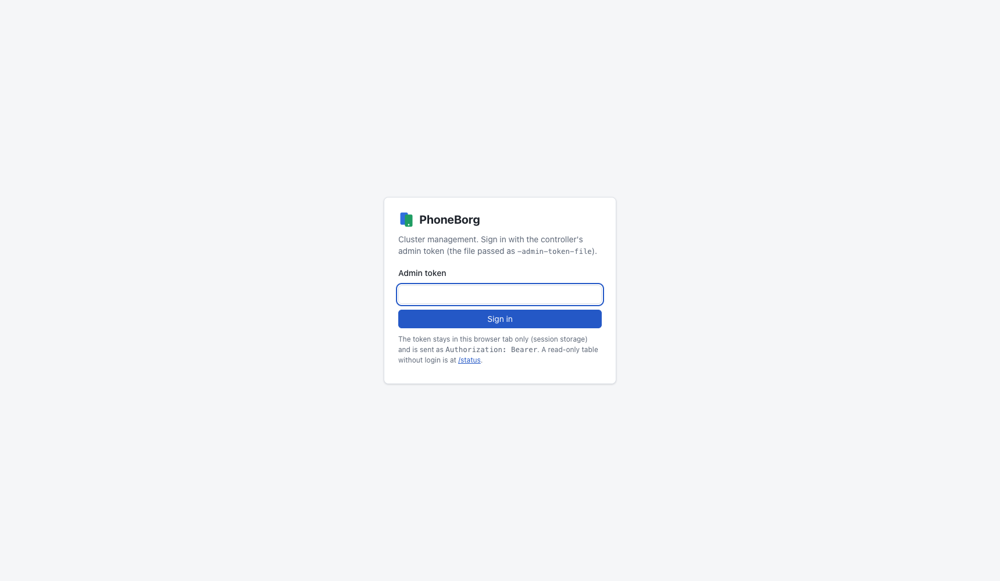

**Overview** — cluster health, throughput, models served, placement warnings and virtual models.

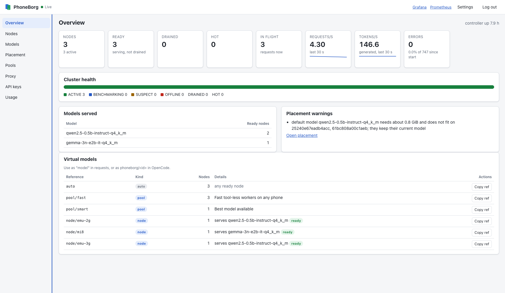

**Nodes** — class/tier, state badges, model and build, threads, context, measured tok/s, RAM, temperature.

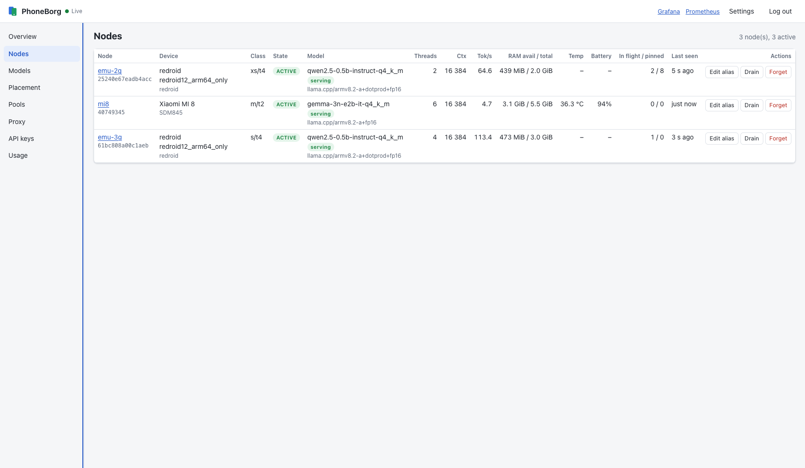

**Node details** — inventory and runtime as reported in heartbeats.

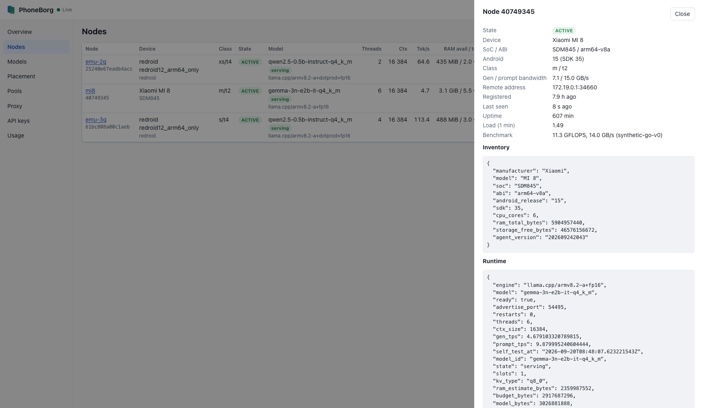

**Models** — the catalog with download status, size, fit, tags and recommendations.

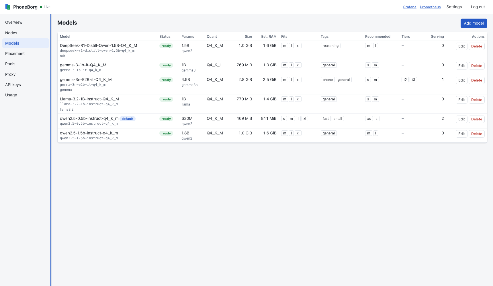

**Placement** — device classes, performance tiers, policies and the current plan with predicted tok/s.

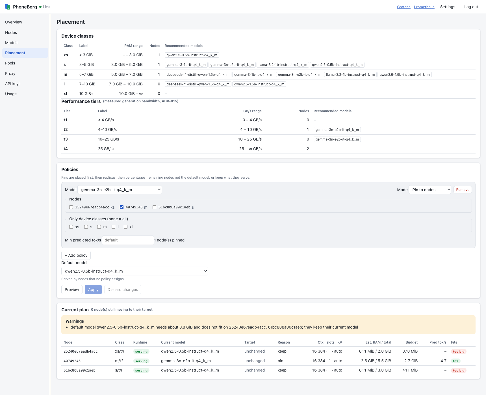

**Pools** — routing, filters and member eligibility with reasons.

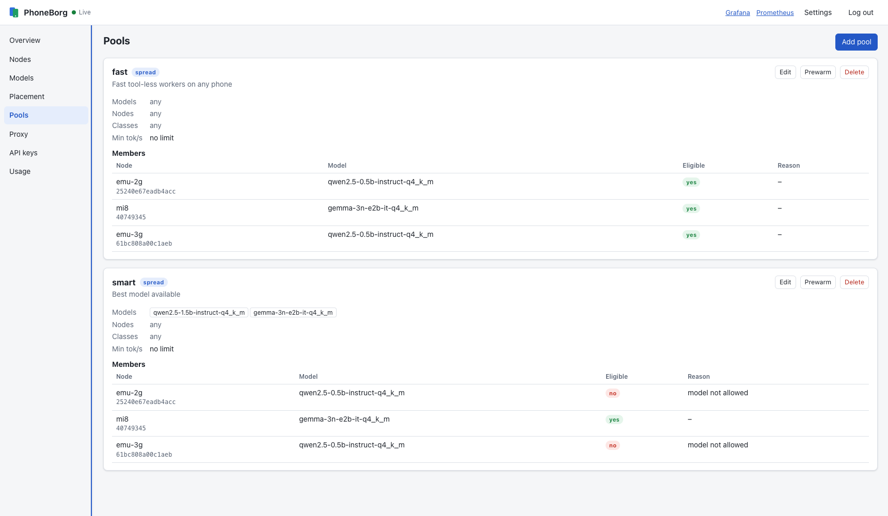

**Proxy** — gateway routing policy, spill, timeout, thermal limit and key enforcement.

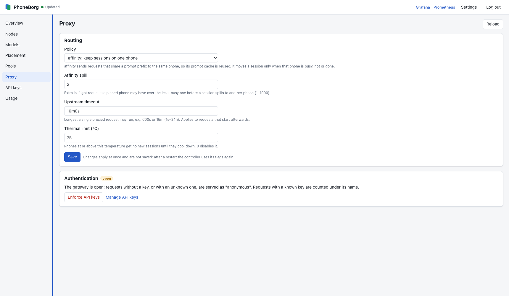

**API keys** — usage per key; create and revoke.

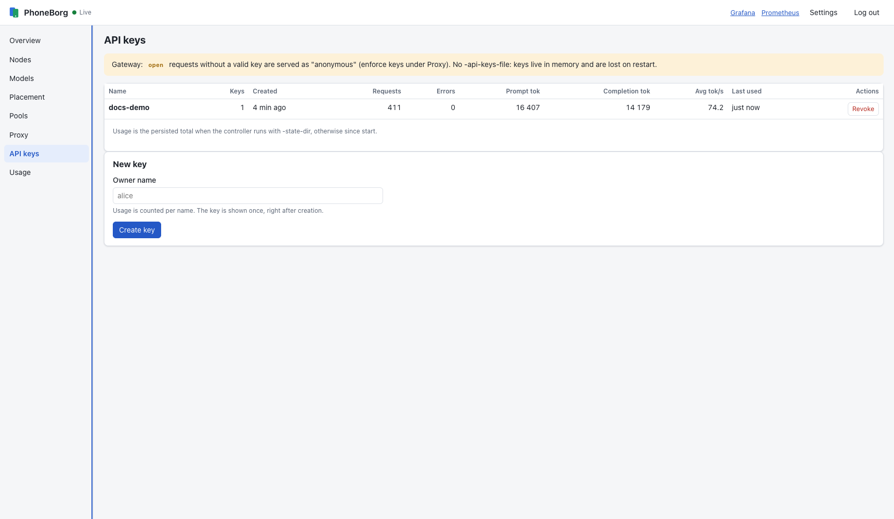

**Usage** — requests and tokens per API key and per node.

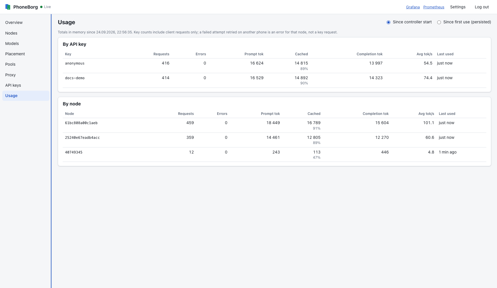

Live views refresh every 5 s. **Settings** sets the Grafana and Prometheus
links (default: ports 3000 and 9090 on the controller's host), or open
`/ui/?grafana=URL&prometheus=URL` once. Against a controller without the
models or pools API, those views say so and the rest works.

## pbctl reference

Build with `make pbctl` (also part of `make all`).

```text
pbctl [-json] [-url URL] [-token-file FILE] <command> [args]
```

| Global flag / variable | Default | Meaning |
|---|---|---|
| `-url`, `PHONEBORG_URL` | `http://127.0.0.1:18080` | controller URL (flag wins) |
| `-token-file FILE`, `PHONEBORG_ADMIN_TOKEN` | none | admin token (flag wins) |
| `PHONEBORG_API_KEY` | none | only used by `pbctl served` when keys are enforced |
| `-json` | off | print the raw API response; accepted anywhere on the line |

```sh
export PHONEBORG_ADMIN_TOKEN=$(grep -v '^#' deploy/dev-admin-token)   # dev stack only: this token is public
bin/pbctl nodes
```

**Nodes**

| Command | What |
|---|---|
| `pbctl nodes` | nodes: state (with `DRAINED`/`HOT`), class/tier (e.g. `m/t2`), runtime, `TOK/S` (self-test), in-flight |
| `pbctl nodes alias <id> <alias>` | set an alias, addressed as `node/<alias>`; `-` clears |
| `pbctl drain <id>` | no new requests; running ones finish |
| `pbctl undrain <id>` | back into rotation |
| `pbctl forget <id>` | remove a node (it re-registers if still running) |

**API keys, gateway, usage**

| Command | What |
|---|---|
| `pbctl keys` | key names, creation time and usage (never the keys) |
| `pbctl keys create <name>` | create a key, printed once |
| `pbctl keys revoke <name>` | revoke all keys of `<name>` |
| `pbctl gateway` | current gateway settings |
| `pbctl gateway set k=v ...` | `policy=affinity\|least_inflight`, `spill=<n>`, `timeout=<duration>`, `auth=keys`, `thermal_limit=<celsius, 0 disables>` |
| `pbctl stats` | uptime, cluster summary, usage by key and node |
| `pbctl served` | what ready phones serve, plus `auto`, pools and aliased nodes (`/v1/models`) |

**Models and placement**

| Command | What |
|---|---|
| `pbctl models` | catalog: status/progress, size, quantization, `FITS (16k)`, tags, serving |
| `pbctl models add <source> [-id ID] [-name NAME] [-tag a,b] [-recommend s,m]` | download a model (`hf://`, `https://`, `file:///`) |
| `pbctl models rm <id>` | remove a model and its file (refused while a policy or the default uses it) |
| `pbctl models tag <id> a,b` | set tags; `-` clears |
| `pbctl models recommend <id> classes=s,m tiers=t2,t3` | recommended classes/tiers (older form `<id> s,m` sets classes); `-` clears |
| `pbctl models default <id>\|none` | model for nodes no policy claims |
| `pbctl classes` | RAM classes and performance tiers with node counts |
| `pbctl placement` | policies, plan per node (`BUDGET`, `PRED TOK/S`), node model states, warnings |
| `pbctl placement set <model> pin=<node,...>\|replicas=<n>\|percent=<p> [classes=s,m] [min_tok_s=<n>]` | set the model's policy |
| `pbctl placement unset <model>` | remove the model's policy |
| `pbctl placement preview [set\|unset] [<model> ...]` | show the plan a change would give; applies nothing |

**Pools**

| Command | What |
|---|---|
| `pbctl pools` | pools and every node's eligibility per pool |
| `pbctl pools set <name> [models=a,b] [nodes=x,y] [classes=s,m] [min_tps=5] [routing=spread\|affinity] [desc="..."]` | create a pool or change only the given fields; `-` clears a list |
| `pbctl pools rm <name>` | remove a pool |

**OpenCode** (see [OpenCode agent bridge](#opencode-agent-bridge))

| Command | What |
|---|---|
| `pbctl opencode init [-dir D] [-provider P] [-base-url URL] [-force] [-read-tools]` | write `opencode.json` and `.opencode/agent/` subagents; `-dir` default `.`, `-provider` default `phoneborg`, `-base-url` default controller URL + `/v1` |
| `pbctl opencode sync [-dir D]` | regenerate from the current cluster (idempotent) |
| `pbctl opencode watch [-dir D] [-interval 15s]` | loop `sync`, logging only changes |
| `pbctl opencode status [-dir D]` | managed agents vs. cluster state |
| `pbctl opencode prewarm [-dir D]` | warm each managed agent's target |

## Models and placement

Phones provisioned with `pcprov -model FILE` serve that file until the
controller says otherwise. The controller can keep a **catalog** of GGUF
models and decide which phone serves which; phones download the file from the
controller over USB and switch. Design: ADR-011, ADR-012.

### Adding models

```sh
pbctl models add hf://Qwen/Qwen2.5-1.5B-Instruct-GGUF/qwen2.5-1.5b-instruct-q4_k_m.gguf -tag chat -recommend m,l
pbctl models                  # progress, then size, quantization, fits, tags
```

Sources:

- `hf://<owner>/<repo>/<file>.gguf` → `https://huggingface.co/<owner>/<repo>/resolve/main/<file>.gguf`;
- any `https://` URL of a `.gguf` file;
- `file:///absolute/path.gguf` on the controller's machine (inside the
  container in the compose stack, so use `hf://` or `https://` there).

The controller downloads into `-models-dir`, resumes interrupted downloads,
computes the SHA-256, reads the GGUF metadata (architecture, parameters,
quantization, trained context, layers, KV heads, resident bytes) and only
then marks the model `ready`. A file that is not a valid GGUF (e.g. an HTML
login page) ends as `error` and is deleted; adding the same id again retries.
Split GGUF files and gated repositories are not supported.

The model id is the file name without `.gguf`, lowercased
(`Qwen2.5-0.5B-Instruct-Q4_K_M.gguf` → `qwen2.5-0.5b-instruct-q4_k_m`), the
same name phones serve when provisioned with that file. Use `-id` to choose
another. Clients put the id in `"model"`.

Phone-sized models (Q4 of 1–4B). File names change between uploads: **check
the name on Hugging Face** first, and check each model's license (Gemma and
Llama have their own terms; `pbctl models -json` shows the license recorded
in the file).

| Model | Source |
|---|---|
| Qwen2.5 1.5B Instruct | `hf://Qwen/Qwen2.5-1.5B-Instruct-GGUF/qwen2.5-1.5b-instruct-q4_k_m.gguf` |
| Gemma 3 1B it | `hf://bartowski/google_gemma-3-1b-it-GGUF/google_gemma-3-1b-it-Q4_K_M.gguf` |
| Llama 3.2 1B Instruct | `hf://bartowski/Llama-3.2-1B-Instruct-GGUF/Llama-3.2-1B-Instruct-Q4_K_M.gguf` |
| Llama 3.2 3B Instruct | `hf://bartowski/Llama-3.2-3B-Instruct-GGUF/Llama-3.2-3B-Instruct-Q4_K_M.gguf` |
| DeepSeek-R1-Distill-Qwen 1.5B | `hf://bartowski/DeepSeek-R1-Distill-Qwen-1.5B-GGUF/DeepSeek-R1-Distill-Qwen-1.5B-Q4_K_M.gguf` |
| Phi-4-mini Instruct (3.8B) | `hf://bartowski/microsoft_Phi-4-mini-instruct-GGUF/microsoft_Phi-4-mini-instruct-Q4_K_M.gguf` |

Which model suits which phone: [REAL_PHONES.md](REAL_PHONES.md#choosing-a-model-per-phone-class).

### Device classes and fit

| Class | RAM |
|---|---|
| `xs` | < 3 GiB |
| `s` | 3–5 GiB |
| `m` | 5–7 GiB |
| `l` | 7–10 GiB |
| `xl` | 10 GiB+ |

The catalog estimates the RAM a model needs at a 16k context: resident bytes
+ an f16 KV cache for 16384 tokens (or the trained context, if smaller) +
150 MiB. `FITS (16k)` in `pbctl models` lists the classes whose smallest
phone has at least that estimate plus 2 GiB for Android. This is a
conservative class-level guide.

Once a phone has sent a heartbeat, placement uses its **actual memory
budget** instead (the same accounting its agent uses), also trying a q8_0 KV
cache and a context halved down to 4096. So a phone with more real headroom
than the 2 GiB guess can get a model `FITS (16k)` does not list. `pbctl
placement` shows each phone's budget in `BUDGET`.

Recommendations (`pbctl models recommend <id> classes=s,m tiers=t2,t3`) and
tags are notes for operators and the panel; the planner does not use them.

### Performance tiers and predicted speed

Generation speed on phones is memory-bandwidth bound. From each node's
self-test the controller computes an effective bandwidth
(`gen tok/s × resident bytes`) and a tier:

| Tier | Bandwidth |
|---|---|
| `t1` | < 4 GB/s |
| `t2` | 4–10 GB/s |
| `t3` | 10–25 GB/s |
| `t4` | 25 GB/s+ |
| `?` | not measured yet |

```sh
pbctl nodes      # CLASS column shows "m/t2": RAM class / performance tier
pbctl classes    # RAM classes, then performance tiers, with node counts
```

`gen_gbps`, `prompt_gbps` and `perf_tier` appear on `/admin/nodes`,
`Placement.nodes` and the panel. A node's value survives restarts
(`routing.json`) and is refreshed after every model switch.

The planner predicts a candidate model's speed on a node as
`gen_gbps × 1e9 / resident_bytes` and skips nodes below the policy's
`min_tok_s`, or else `-min-predicted-tok-s` (default 3). A node with no
measurement is never excluded. A pin still places below the threshold, with a
warning. This is unrelated to a pool's `min_gen_tps`, which filters nodes by
what they already serve. Numbers behind this: [BENCHMARKS.md](BENCHMARKS.md#effective-bandwidth-and-performance-tiers).

```sh
pbctl placement set google_gemma-3-1b-it-q4_k_m percent=50 min_tok_s=4
pbctl placement   # PRED TOK/S column
```

### Placement policies

One phone serves one model. Policies apply in this order:

1. **pin**: these phones serve the model, even if it does not fit or is
   predicted too slow (with a warning).
2. **replicas**: this many phones.
3. **percent**: this share of the phones where it fits (rounded half up, at
   least one).
4. **default model**: every unclaimed phone where it fits.
5. Otherwise a phone **keeps** what it serves (e.g. its `pcprov -model` file).

`classes=` limits replicas and percent policies to those classes;
`min_tok_s=` excludes phones predicted slower. Bigger models choose first and
get the faster phones. A phone already serving a model stays on it. Drained
phones only follow pins.

```sh
pbctl placement set qwen2.5-1.5b-instruct-q4_k_m replicas=2 classes=m,l
pbctl placement set llama-3.2-3b-instruct-q4_k_m pin=5f1e2d3c4b5a6978
pbctl placement set google_gemma-3-1b-it-q4_k_m percent=50
pbctl models default qwen2.5-0.5b-instruct-q4_k_m
pbctl placement preview set google_gemma-3-1b-it-q4_k_m percent=100   # what would change; applies nothing
pbctl placement                    # policies, plan per phone, states, warnings
pbctl placement unset google_gemma-3-1b-it-q4_k_m
```

The plan is recomputed on every change, when phones join, leave or are
drained, when a model becomes ready, and every 10 s. Phones learn their
assignment from the next heartbeat reply, download from
`/v1/model-files/<id>`, size and load the model (see
[ARCHITECTURE.md](ARCHITECTURE.md#model-placement-and-switching)). While a
phone switches it gets no requests. A policy for a model still downloading
waits, with a warning. A model used by a policy or the default cannot be
removed.

Policies and the default model are saved to `<state-dir>/placement.json`,
the catalog to `<state-dir>/models.json`.

## Virtual models, pools and aliases

The `model` field of a request can name a routing target, so one client (for
example several opencode subagents) can address groups of phones or a single
phone. Design: ADR-014.

| `model` | Goes to |
|---|---|
| `<model id>` | ready phones serving that model (session affinity) |
| `auto` | any ready phone (session affinity) |
| `pool/<name>` | the pool's eligible members, routed per the pool's `routing` |
| `node/<alias-or-id>` | exactly that phone; never retried elsewhere; 503 `node_unavailable` if not ready |

An unknown pool or node gets 404 `model_not_found`; a pool with no eligible
phone gets 503. Context checks, draining and the thermal limit apply to every
target, except that a `node/` target is served even when hot.
`phoneborg_gateway_target_requests_total{target}` counts requests per target.

**Aliases** are short names that survive re-registration and restarts
(`<state-dir>/routing.json`). They match `^[a-z0-9][a-z0-9-]{0,31}$`, are
unique, are not another node's id, do not start with `pool` and are not
`auto`.

```sh
pbctl nodes alias mi8-6f3a phone-01        # "-" removes the alias
curl -X PATCH http://127.0.0.1:18080/admin/nodes/mi8-6f3a \
  -H "Authorization: Bearer $PHONEBORG_ADMIN_TOKEN" -d '{"alias":"phone-01"}'
```

**Pools** select phones by served model, alias or id, class and measured
speed (empty lists mean "any"). Hot, drained, not ready and switching phones
are never eligible.

```sh
pbctl pools set fast models=qwen2.5-0.5b-instruct-q4_k_m classes=s,m min_tps=5 desc="small agents"
pbctl pools set pair nodes=phone-01,phone-02 routing=affinity
pbctl pools
pbctl pools rm pair
```

The admin API replaces a whole pool:

```sh
curl -X PUT http://127.0.0.1:18080/admin/pools/fast \
  -H "Authorization: Bearer $PHONEBORG_ADMIN_TOKEN" \
  -d '{"description":"small agents","models":["qwen2.5-0.5b-instruct-q4_k_m"],
       "classes":["s","m"],"min_gen_tps":5,"routing":"spread"}'
curl -X DELETE http://127.0.0.1:18080/admin/pools/fast -H "Authorization: Bearer $PHONEBORG_ADMIN_TOKEN"
```

Responses list `members` with `eligible` and a `reason` (`not a member`,
`class not allowed`, `drained`, `switching`, `not ready`, `hot`,
`model not allowed`, `below min_gen_tps`).

`routing` is `spread` (default: fewest in-flight, then fastest, no session
pins) or `affinity` (like plain model ids). Use `spread` for small tool-less
agents whose prompts are cheap to recompute, `affinity` for long system
prompts or tools.

```sh
curl http://127.0.0.1:18080/v1/chat/completions \
  -d '{"model":"pool/fast","messages":[{"role":"user","content":"Summarise: ..."}]}'
```

`/v1/models` gives every entry a `kind` (`model`, `auto`, `pool`, `node`) and
lists targets after the served models. Only aliased phones get a `node/`
entry; `node/<id>` still works. In opencode, reference them as
`phoneborg/pool/fast` or `phoneborg/node/phone-01`.

**Prewarming.** `POST /admin/prewarm` sends every eligible phone of a target,
in parallel, the given messages (and tools) plus a final user `ok` with
`max_tokens: 1` and `cache_prompt: true`, so the prefix is cached before real
requests. Each phone gets up to 120 s; drained phones are skipped.

```sh
curl -X POST http://127.0.0.1:18080/admin/prewarm \
  -H "Authorization: Bearer $PHONEBORG_ADMIN_TOKEN" \
  -d '{"target":"pool/fast","messages":[{"role":"system","content":"You are a terse reviewer."}]}'
# {"results":[{"node_id":"mi8-6f3a","alias":"phone-01","ok":true,"ms":4210,"error":""}, ...]}
```

## API keys

Each key has an owner name; usage is counted per name. The gateway runs in
one of two modes:

- **open** (default without `-api-keys-file`): requests without a key, or
  with an unknown one, are served as `anonymous`; known keys are counted
  under their name.
- **keys** (default with `-api-keys-file`): requests without a valid key get
  401. Clients send `Authorization: Bearer <key>` or `x-api-key: <key>`.

```sh
pbctl keys create alice          # prints the key once: pb-...  store it now
pbctl keys                       # names, creation time, usage; never the keys
pbctl keys revoke alice          # immediate
```

- With `-api-keys-file`, changes are written to that file atomically, mode
  0600, as SHA-256 hashes: `alice sha256:<hex> 2026-09-23T10:00:00Z`. Legacy
  `<name> <key>` lines still work and are rewritten as hashes on the first
  change.
- Without `-api-keys-file`, keys live in memory and are lost on restart
  (pbctl says so).
- After editing the file by hand: `kill -HUP <controller pid>`. A broken file
  is rejected and the current keys stay.
- Creating keys does not close an open gateway. Enforce with
  `pbctl gateway set auth=keys` once every client sends one. Switching back
  to open needs a restart without `-api-keys-file` (ADR-008).

## Draining a phone for maintenance

```sh
pbctl nodes                      # find the node id (serial or android_id)
pbctl drain 5f1e2d3c4b5a6978     # no new requests; running ones finish
pbctl nodes                      # wait until INFLIGHT is 0
# unplug, reflash, cool down, replace the battery...
pbctl undrain 5f1e2d3c4b5a6978
```

Pinned sessions move to other phones on their next request. The drain is
kept by node id, so it survives the phone re-registering, but not a
controller restart. The panel and `/status` show **DRAINED**; Prometheus has
`phoneborg_node_drained{node_id}`.

`pbctl forget <id>` removes a node, e.g. a retired phone. A running phone
registers again on its next heartbeat. Requests in flight on a forgotten
node are retried elsewhere, so drain first if they should finish.

## Gateway settings

```sh
pbctl gateway                                    # current settings
pbctl gateway set policy=least_inflight          # plain load balancing
pbctl gateway set policy=affinity spill=3        # session affinity, tolerate 3 extra in-flight requests
pbctl gateway set timeout=900s                   # for requests that start afterwards
pbctl gateway set thermal_limit=70               # phones at/above 70 °C get no new sessions; 0 disables
```

Changes apply at once and are not saved. After a restart the controller uses
its flags again: policy `affinity` with `spill=2`, `-upstream-timeout`,
`-thermal-limit-c` (default 75 °C). A hot phone gets no new sessions unless
every ready phone is hot, and loses its pinned sessions to a cooler one
(ADR-010).

## Usage statistics

```sh
pbctl stats
```

Shows uptime, nodes by state, drained and ready phones, models, then usage by
API key and by node: requests, errors, prompt, cached prompt and completion
tokens, average generation speed (token-weighted) and last use.

- **Since start**: always.
- **Since first use**: only with `-state-dir`; saved to `usage.json` every
  30 s and on SIGINT/SIGTERM. A corrupt `usage.json` stops startup; move it
  away to start from zero.

Key counts include only client requests. A failed attempt retried on another
phone counts as an error for that node, not as a request for the key. Errors
are all outcomes other than 200, including disconnected clients (499).

## OpenCode agent bridge

`pbctl opencode` writes and keeps in sync an opencode provider entry and
`.opencode/agent/` subagents that target the cluster's virtual models.

```sh
export PHONEBORG_URL=http://127.0.0.1:18080
export PHONEBORG_ADMIN_TOKEN=$(grep -v '^#' deploy/dev-admin-token)
cd my-project
pbctl opencode init          # opencode.json and .opencode/agent/*.md
pbctl opencode status        # NAME | TARGET | SERVED MODEL | NODES READY | STATUS
pbctl opencode sync          # after nodes join, leave or get an alias
pbctl opencode watch         # sync every 15 s, log only changes
pbctl opencode prewarm       # warm each agent's target
```

`init`:

- Creates the `fast` pool (spread routing, any phone) if missing; a
  controller without the pools API is skipped with a warning.
- Writes `opencode.json` with `provider.phoneborg` listing every model
  `/v1/models` reports (served models, `auto`, pools, `node/<alias>`), each
  with the node's context size when known, else 16384. An existing plain JSON
  file without the block gets it merged in (a `.bak` is kept); a JSONC file,
  or one that already has the block, is left alone and the block is printed
  (`-force` replaces it in plain JSON). The global `~/.config/opencode` is
  never touched.
- Writes agents `borg-fast`, `borg-summarize`, `borg-review` (all
  `pool/fast`) and one `phone-<alias>` per aliased node (`node/<alias>`, no
  failover). All are `mode: subagent` and tool-less (`tools: {"*": false}`);
  `-read-tools` allows `read`, `grep` and `glob` (~1k extra prompt tokens per
  call). Generated files carry a `<!-- generated by pbctl opencode -->`
  marker and a content hash in `.opencode/phoneborg-managed.json`.

`sync` adds agents for new aliases, removes those for aliases that are gone
and refreshes the provider's model list in a plain-JSON config. It is
idempotent and prints `added/removed/updated/kept`. A managed file edited by
hand is kept, with a warning. `prewarm` sends each agent's prompt body to
`POST /admin/prewarm` for its target.

Tool-less agents send ~182 prompt tokens against ~11.7k for opencode's
default build agent, which is why they are the default. Use them like any
subagent, including in parallel:

```text
use @borg-review and @borg-summarize in parallel on the diff and the PR description
```

Spreading over phones gives parallelism; pool membership decides quality
(measured: 9.9 s on `pool/fast` vs 23.8 s on one phone, but fewer correct
answers from the 0.5B phones; [BENCHMARKS.md](BENCHMARKS.md#parallel-agents-pool-vs-single-node)).
Use a pool restricted to stronger models where correctness matters.

## Grafana and Prometheus

`make cluster-up` provisions Prometheus on http://127.0.0.1:9090 and Grafana
on http://127.0.0.1:3000 (anonymous view, `admin`/`admin` to edit) with the
"PhoneBorg" dashboard:

| Row | Shows |
|---|---|
| Cluster | active and unhealthy nodes, models ready, requests/s, tokens/s, error ratio |
| Inference gateway | requests and latency per node, generation speed, throughput, in-flight, status codes, failover, rejections, prompt cache hit ratio, routing decisions |
| Usage per API key | requests and tokens (input/output/cached) per key |
| Nodes | state, RAM, load, heartbeat age, temperature, runtime ready/restarts, synthetic benchmark, self-test tok/s, hot nodes |
| Models | catalog, downloads, planned vs serving nodes, switching nodes, model errors |
| Administration | drained nodes, admin actions (`phoneborg_admin_actions_total`; rising `result="unauthorized"` means wrong tokens are being tried) |
| Pools and virtual models | requests per target, eligible nodes per pool |

### Dashboard screenshots

The dashboard during a 4-minute load test on the dev cluster. The Temperature panel shows the Mi 8 overheating (up to 96 °C) under sustained direct `node/mi8` traffic.

**Cluster**

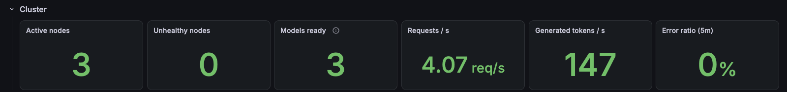

**Inference gateway**

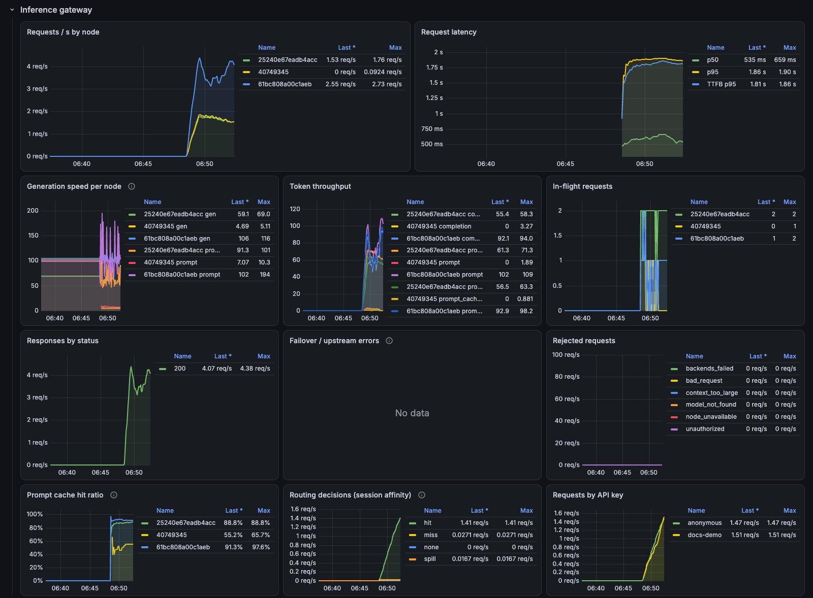

**Usage per API key**

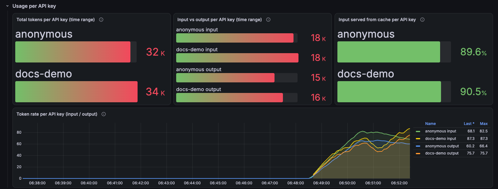

**Nodes**

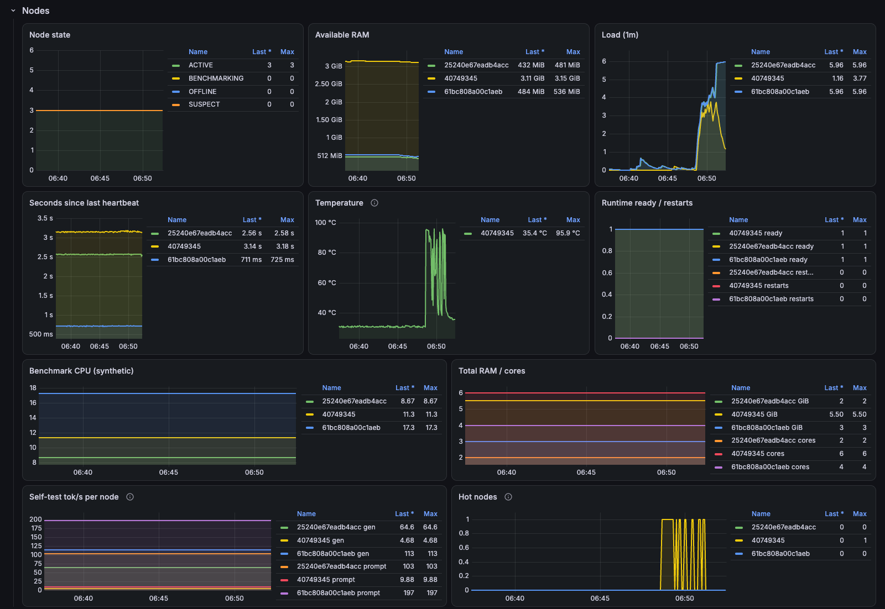

**Models**

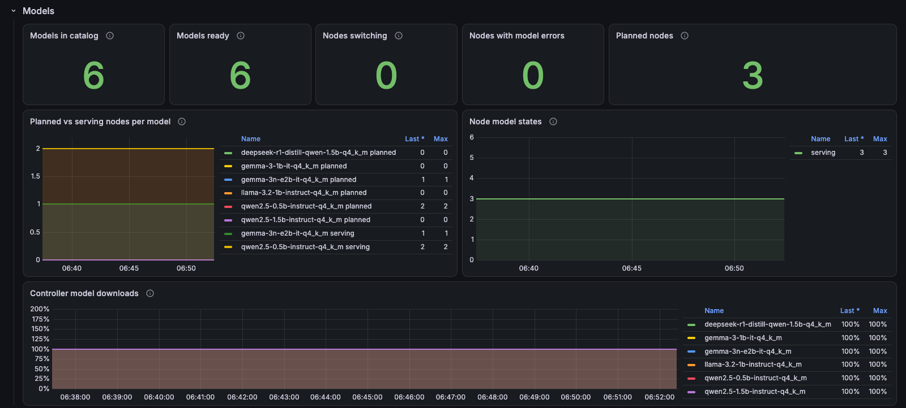

**Administration**

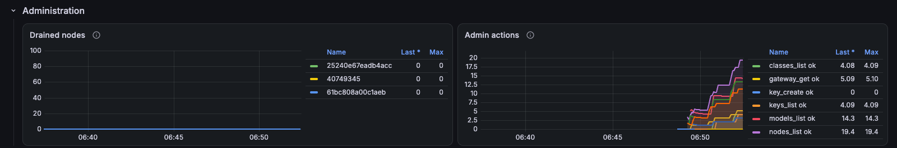

**Pools and virtual models**

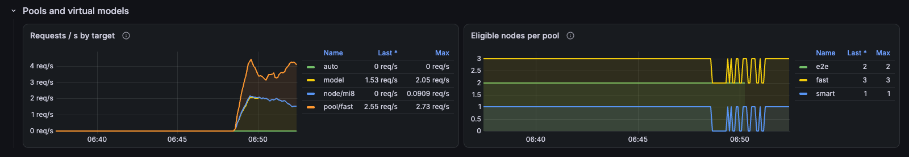

Battery level is exported as `phoneborg_node_battery_level_percent` (and
shown in the panel's Nodes view) but has no Grafana panel yet.

Prometheus in the compose stack keeps 15 days or 1 GB, whichever comes
first. For all-time totals use `pbctl stats` with `-state-dir`.

## Troubleshooting

Phone-side problems (adb, SIGILL, sleep, thermal) are in
[REAL_PHONES.md](REAL_PHONES.md#troubleshooting).

| Symptom | Cause | What to do |
|---|---|---|
| 400 `context_length_exceeded` | the prompt (estimated as body bytes / 4) is larger than every ready node's context | place the model through the controller (16k context when RAM allows) or provision with `-agent-args "-ctx-size 16384"`; use a smaller prompt or tool-less agents |
| 503 `node_unavailable` | a `node/<alias>` target is offline, drained, loading or switching models | `pbctl nodes`; undrain or wait; node targets never fail over by design |
| 503 `... has no eligible ready node` | pool members all ineligible | `pbctl pools` shows each node's `reason` |
| 404 `model_not_found` | no ready node serves that model id, or unknown pool/node | `pbctl served`; check placement and spelling |
| 503 `no ready nodes` | no phone is `ACTIVE` with a ready runtime | `pbctl nodes`, then [REAL_PHONES.md](REAL_PHONES.md#troubleshooting) |
| 502 `backends_failed` | both attempts failed | controller log `backend failed`, the phone's `runtime.log` |
| 401 `invalid_api_key` | keys enforced, key missing or wrong | `pbctl keys`; send `Authorization: Bearer <key>` |
| `/admin/...` answers 503 | admin API disabled | start the controller with `-admin-token-file` |
| Controller refuses to start: usage state | `usage.json` is corrupt | move it away (usage restarts from zero) |
| Model stays `error` in `pbctl models` | not a GGUF (e.g. a login page for a gated repo), split file, or 4xx | check the URL and file name on Hugging Face; `pbctl models add` again to retry |
| Placement warning "predicted X tok/s < N" | the node is too slow for that model (ADR-015) | smaller model, lower `min_tok_s`, or accept via a pin |
| Node shows `runtime.state` `error` after a switch | download, sizing or load failed; the old model keeps serving if cached | `pbctl nodes -json`, the phone's `agent.log`; the agent retries after 30 s, backing off to 10 min |
| Prometheus stops ingesting, Grafana empty | Docker/colima disk full | `docker system df`, free space; the compose stack caps Prometheus at 15 d / 1 GB so this should not recur from Prometheus alone |
| Requests pile up on one phone | session affinity with a shared prompt prefix | `pbctl gateway set spill=1`, or a pool with `routing=spread` |
