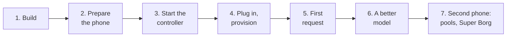

# Quick start: a test cluster with one or two phones

This is the shortest path from a phone in a drawer to a working
OpenAI-compatible endpoint, a web panel and, with a second phone, a pool
and a Super Borg job. It takes about 30–45 minutes, most of it builds and
downloads. Details for every step are in [REAL_PHONES.md](REAL_PHONES.md)
and [OPERATIONS.md](OPERATIONS.md).



## What you need

| | Minimum | Notes |
|---|---|---|
| Host | Linux or macOS with Go 1.25+, `adb` (Android platform-tools), Docker | Docker only builds llama.cpp for the phones |
| Phone | ARM64 Android with USB debugging, 4 GB RAM or more | 6–8 GB fits 1.5–4B models; a cracked screen is fine |
| Cable | a USB data cable (not charge-only) | two phones: a powered hub, 2–3 A per port |

## 1. Build

```sh
git clone https://github.com/dzaczek/phoneborg && cd phoneborg
make all                                         # tests + bin/controller, bin/pcprov, bin/pbctl, the phone agent
make llama-all                                   # llama.cpp for phones, 3 CPU variants (Docker, ~10–20 min)
make models/qwen2.5-0.5b-instruct-q4_k_m.gguf   # small bootstrap model (~0.5 GB)
```

## 2. Prepare the phone

1. Settings → About phone → tap **Build number** 7 times.
2. Settings → System → Developer options → **USB debugging** on. On
   Xiaomi, Redmi and POCO also **USB debugging (Security settings)**.
3. Plug it in, unlock it, tap **Allow** and tick **Always allow from this
   computer**.
4. Check:

```sh
adb devices -l      # the phone must show "device", not "unauthorized"
```

Take the phone out of its case: it will run warm.

## 3. Start the controller

The admin token protects the admin API and the web panel. Keep it in a
file that only you can read.

```sh
mkdir -p ~/.config/phoneborg state
(umask 077; openssl rand -hex 32 > ~/.config/phoneborg/admin-token)

bin/controller -admin-token-file ~/.config/phoneborg/admin-token -state-dir state
```

Leave it running and use a second terminal for the next steps:

```sh
export PHONEBORG_ADMIN_TOKEN=$(cat ~/.config/phoneborg/admin-token)
```

## 4. Provision the phone

```sh
bin/pcprov watch -model models/qwen2.5-0.5b-instruct-q4_k_m.gguf -agent-args "-ctx-size 16384"
```

`watch` installs the agent, llama.cpp and the model on every phone that
is plugged in, and repairs the USB links if a phone drops off. Leave it
running too. In a third terminal:

```sh
bin/pbctl nodes          # BENCHMARKING, then ACTIVE with a tok/s value, within a minute or two
```

Keep the phone awake on USB (vendor ROMs may sleep with the screen off):

```sh
adb shell svc power stayon usb
```

## 5. First request

```sh
curl http://127.0.0.1:18080/v1/chat/completions \
  -d '{"model":"auto","messages":[{"role":"user","content":"Hello from a phone cluster!"}]}'
```

Open the web panel at <http://127.0.0.1:18080/ui/> and sign in with the
admin token: **Nodes** shows the phone, **Chat** talks to it.

## 6. A better model

The bootstrap model only proves the setup. Give the phone a real one; the
controller downloads it once and the phone fetches it over USB:

```sh
# 4–6 GB RAM
bin/pbctl models add hf://Qwen/Qwen2.5-1.5B-Instruct-GGUF/qwen2.5-1.5b-instruct-q4_k_m.gguf
bin/pbctl models default qwen2.5-1.5b-instruct-q4_k_m

# 8 GB RAM or more: better answers and reliable tool calling
bin/pbctl models add hf://unsloth/Qwen3-4B-Instruct-2507-GGUF/Qwen3-4B-Instruct-2507-Q4_K_M.gguf -tag general,tools
bin/pbctl models default qwen3-4b-instruct-2507-q4_k_m

bin/pbctl placement      # the plan and each phone's state: downloading → loading → serving
```

The phone keeps serving the old model until the new one is loaded. Do not
restart the controller while a phone is downloading.

## 7. A second phone

Prepare it as in step 2 and plug it in; the running `watch` provisions it.
Then name both phones, so they are easy to address:

```sh
bin/pbctl nodes                          # note the node ids
bin/pbctl nodes alias <id-1> big         # the phone with more RAM
bin/pbctl nodes alias <id-2> small
```

Now try what more than one phone gives you:

```sh
# A pool: requests spread over both phones
bin/pbctl pools set duo routing=spread
curl http://127.0.0.1:18080/v1/chat/completions \
  -d '{"model":"pool/duo","messages":[{"role":"user","content":"Name three uses for an old phone."}]}'

# One phone directly
curl http://127.0.0.1:18080/v1/chat/completions \
  -d '{"model":"node/small","messages":[{"role":"user","content":"Hi!"}]}'

# Super Borg: "big" plans and delegates, "small" works
bin/pbctl pools set borg routing=superborg nodes=big,small orchestrator=big
curl http://127.0.0.1:18080/v1/chat/completions \
  -d '{"model":"pool/borg","messages":[{"role":"user","content":"Compare tea and coffee: health, cost and taste. Delegate one part per worker."}]}'

# A background job on the Super Borg pool; follow it in the panel's Jobs view
bin/pbctl jobs new pool=borg "Write a short story in three chapters about a robot that repairs phones."
bin/pbctl jobs
```

With two phones a Super Borg pool has one worker, so it shows the idea
rather than a speed-up. The orchestrator works best with a model tagged
`tools` (Qwen3). See [CONCEPTS.md](CONCEPTS.md) for what each way of using
the cluster is good for.

Two pools that both name a phone must allow the same model for it, or the
second one is refused. Switch one off with
`bin/pbctl pools set duo enabled=off`.

## 8. Use it from your tools

| Client | Setting |
|---|---|
| any OpenAI SDK or app | base URL `http://127.0.0.1:18080/v1`, model `auto`, `pool/<name>` or `node/<alias>`, any API key |
| Ollama clients | `http://127.0.0.1:18080` (or start the controller with `-ollama-listen :11434`) |
| opencode | `bin/pbctl opencode init` in your project: provider, one subagent per phone, the MCP tools |

Only this machine may use the gateway without a key. For other computers
on your network, either create a key (`bin/pbctl keys create laptop`) or
trust your subnet with `-trusted-cidrs 127.0.0.0/8,::1/128,192.168.1.0/24`
on the controller.

## 9. Stop and clean up

```sh
# Ctrl-C pcprov watch and the controller, then for each phone:
bin/pcprov stop -serial <SERIAL>
adb -s <SERIAL> shell rm -rf /data/local/tmp/phoneborg
adb -s <SERIAL> shell settings put global stay_on_while_plugged_in 0
```

`state/` keeps the catalog, downloaded models, pools and aliases for the
next start.

## If something is off

| Symptom | Fix |
|---|---|
| `adb devices` shows `unauthorized` | unlock the phone and accept the prompt; replug |
| the phone is not listed at all | a charge-only cable or USB debugging off |
| the node goes `SUSPECT` when the screen turns off | `adb shell svc power stayon usb` |
| `pbctl placement` shows an error like "model needs X MiB, budget Y MiB" | the model is too big for the phone: use a smaller one |
| answers slow down after a few minutes | the phone is hot: take it out of its case, cool it |
| `pbctl: no admin token` | `export PHONEBORG_ADMIN_TOKEN=$(cat ~/.config/phoneborg/admin-token)` |

More: [REAL_PHONES.md](REAL_PHONES.md#troubleshooting) and
[OPERATIONS.md](OPERATIONS.md#troubleshooting).
